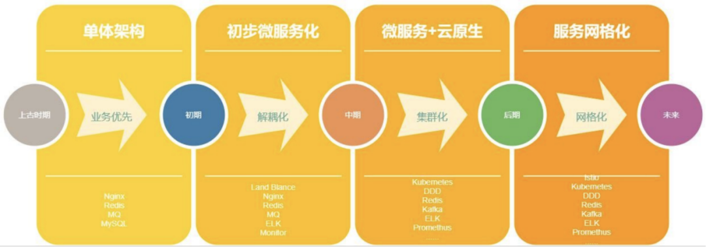
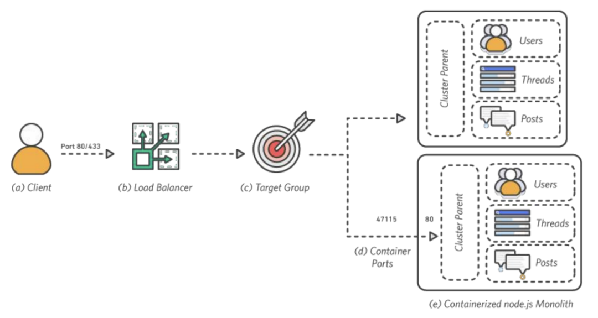
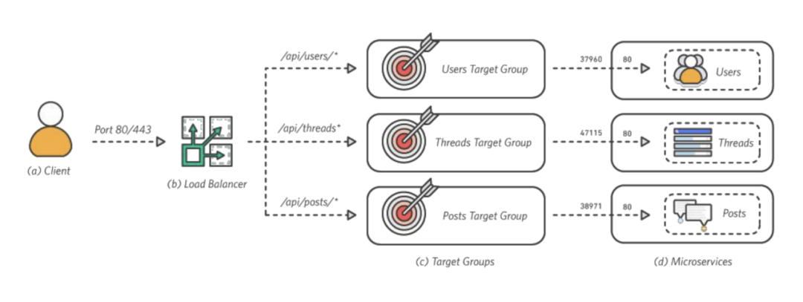
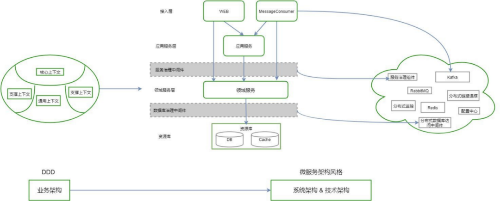
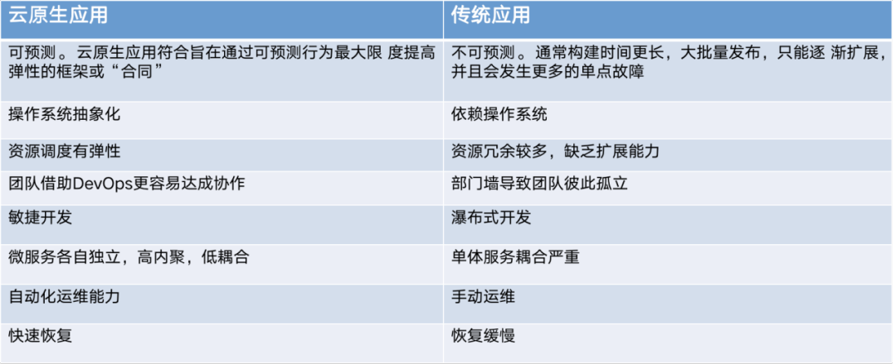
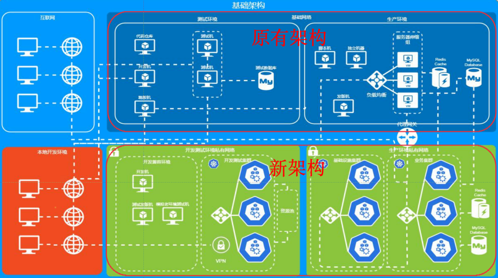
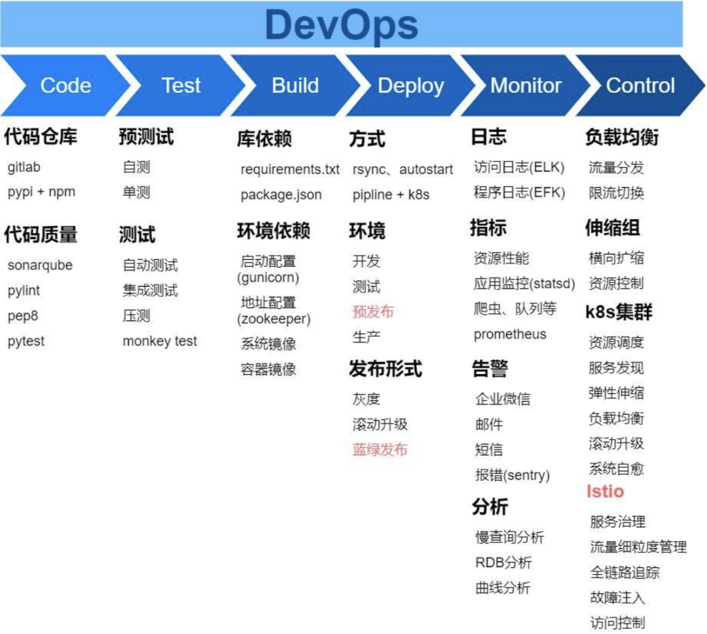
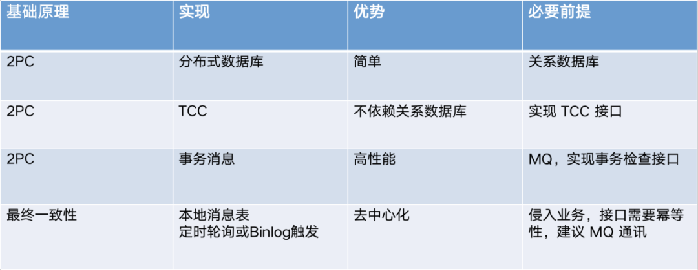
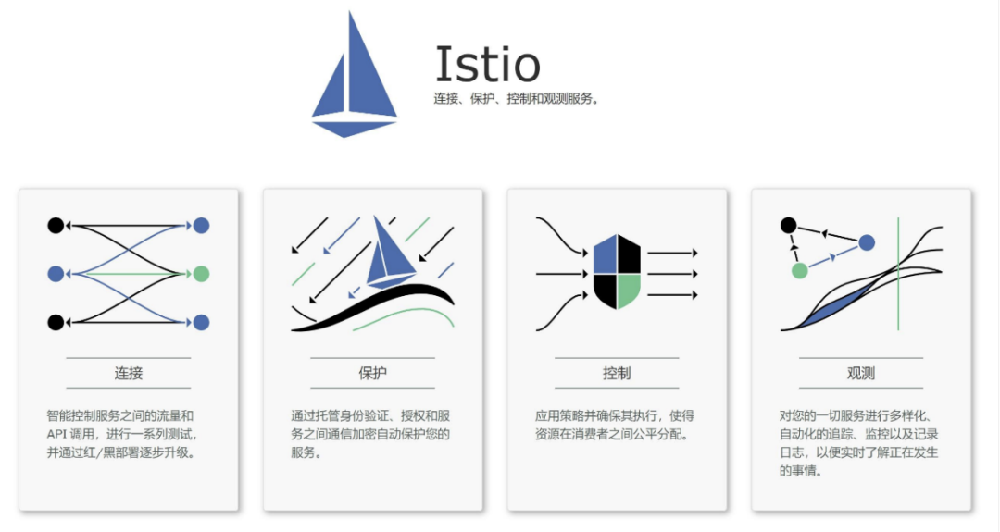
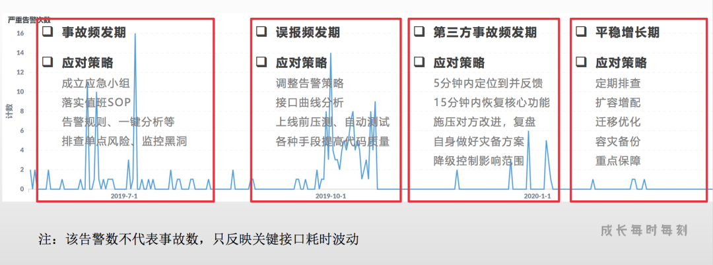

# 荔枝微课基础架构的演进与实践

近几年，云原生技术和理念得到广泛接受，众多企业开始探索云原生架构转型落地。本文将会详细讲述荔枝微课是如何做云原生下的微服务基础架构设计。

王诚强，荔枝微课基础架构负责人。主要从事基础技术研究开发、基于云原生的基础架构设计以及基础架构团队的管理建设。致力于云原生理念下，以微服务搭建中台。

### 云原生：未来架构的演化方向
云原生（Cloud Native）是未来架构的演化方向，包含了一组应用模式，用于帮助企业快速、持续、可靠、规模化地交付业务软件，由微服务架构、DevOps 和以容器为代表的敏捷基础架构组成，其中包含很多有利于我们做更多扩展持续演进的理念。我认为云原生是一种文化、一种理念， 也是一种生态，既包括技术（微服务、敏捷基础设施 K8S），也包括管理（DevOps、持续交付）， 范围极其广泛，**总得来讲是一种围绕云计算时代的架构**。

虽说出现得相对比早期的 Spring Cloud 要晚一些，但也是非常先进的，像谷歌最早期贡献出来的 K8S，之后各大公司也都是在这个开源项目上不断去迭代更新，因此它的生态很完善。下图中完整的展示了云原生的整个生态，包括了很多不同的环节，比如数据库，还有消息流，网关、服务网格等等，这里就不再一一列举了，大家有兴趣可以去深入了解。附[CNCF全景图](https://landscape.cncf.io/)：


### 云原生的演进历程

2001年虚拟机进入到了一个可商用的阶段， 2013 年 Docker 发布后会发现很多开源项目、个人开发者都开始用`Docker`去发布自己的应用；2015年`CNCF（云原生计算基金会）`成立，2018 年 Kubernetes 从 CNCF 毕业，到了 2019 年我们会发现它已是大家时常谈论的热点。云原生开始大热，因为它已经形成了一个比较成熟的体系，各大云厂商也开始把自己的云服务、容器服务等开始推向市场，这时大家也不用从零开始自建，这也告诉我们要去把握技术发展的趋势，懂得借势，而不是什么都是从零开始。

### 荔枝微课架构的演进历程

#### 上古时期：单体架构，业务优先
所谓的上古时期可以理解成公司的创始时期，这时优先以业务为主，如果连业务都没起来又谈何去做更多的技术发展，这个阶段可能使用单体架构更容易做到迭代。不过它的优点是业务起步快，一个人单枪匹马就可以把整个项目给建起来了，可能就那么一两个服务，它的部署维护也要简单很多，目的就是先把业务做起来。

单体架构的缺点也很明显，一个单体项目功能太多，新人就不易上手，项目越做越复杂，耦合度越来越高，会给后期新进人员带来很多难题，我们私下称之为“死伤”，不利于扩展新功能。其中最麻烦的是后面的新人要去接手并开展新功能，如果代码质量有问题，可能一个局部 BUG 就会影响到整体。而且有很多已经完成的功能，会重复使用到新的业务中，比如支付、账号等这些同样的功能，难道又要重新做一遍吗？

不过上古时期的整体架构也不一定只有一个服务器、一个服务，也是有一些伸缩性的。上图中的Users、Threads、Posts 构成了整个单体结构的应用，它是可复制的，比如在负载均衡下面挂多个。另外它是无状态的，所谓无状态是指不会因为多一台服务伸缩出来而导致服务不可用，其中需要特别注意的是一些需要设置白名单的，比如 IP 白名单，多一台机器，可能 IP 就对不上了，会导致其他的环节报错。不过这可以通过一些软件设计的方法，比如代理、生产消费这种模式去处理。

#### 初期：初步微服务，解耦化
初期阶段单体结构会变得越来越复杂，维护起来也会越来越难。想象一下，一个系统里面可能有几十甚至上百个不同的模块，不同的文件夹，一个新人看完这些代码都需要花很多的时间，又谈何了解整体并做维护呢？甚至整个要跑起来所要了解的知识也很多。因此后面就需要会做解耦化，也就是我们所说的初步微服务化。不过初期还是由业务来推动的，这个时候的目标还是拓展不同的项目，解耦的话也不会一步就到容器化。该阶段需要先对服务做松耦合，方便新人进来后去维护代码，另外就是做很多像监控这类兜底的能力。

说到服务做松耦合（解耦），因为早期没有很好的统筹，很多应用是解耦了，但它的技术栈多而杂，甚至连部署方式也都不一样，如果是原来维护项目的开发人员走了，由你来接手，它的语言、框架、部署方式都不同，维护工作会很难进行。**拆分后也会面临到服务关系问题，服务少的时候还能明确服务之间的调用关系，当服务多了后，调用关系就会比较乱**，特别是为了方便调用，快速上线将配置跟代码混合一起的情况，这样拆分后反而会带来更多麻烦。因此上古时期以业务为主，需要衡量一下是否拆分，业务有没有这个需求，不能因为做拆分而影响业务，另一个是如果人员不够也不适合去做拆分，维护起来会更麻烦。

整体式架构拆分如上图所示，这里写到是 Container Ports，与以前相比更理想化了一些，需要先进行容器化，拆分之后将 Users 服务、Threads 服务、Posts 服务分别对应不同的 API 入口，分别去扩展会更利于去维护。比如负责 Posts 开发的，就只需专注于这一块。

##### 领域驱动设计与微服务
拆分中有一个词叫领域驱动设计（Domain-Driven Design，简称 DDD），是一种由域模型来驱动系统设计的思想，最早前的还是通过数据库等数据源来驱动系统设计 （Model-Driven Design，简称 MDD）。领域驱动则会划分业务和功能，比如说支付、订单或者是用户等，拆分后的可复用性就更强了，相互调用就可以。领域模型是对业务模型的抽象，领域驱动设计相对比较复杂，有兴趣的可以去深入了解，总的来说规划设计不是一成不变的，按自己最适合的来就好了。

拆分后也会面临一些问题，因为服务变多了，部署、管理、资源规划会特别麻烦，期望每一个微服务有自己的专用数据库，前面说到了要衡量是否拆分，规模很小的话做这个是得不偿失的，应该先把量做起来，比如单表过亿、超大量了，对数据库做组成、只读、读写分离、分表都没有用的时候再去考虑分库。而且拆分之后使用了专用数据库，它们之间的调用会是个麻烦，特别是分布式事务，下面会再详细讲解。

#### 中期：深水期改革，实现集群化
中期是集群化的过程，也可以说是容器化。我个人认为在当时的时间节点上，顺序可能是反了，应该是**容器化做得越早越好，这样解耦的时候会减少很多不必要的麻烦**，当然这个也跟历史时间的趋势有关系，可能之前没有兴趣，大家觉得这个技术不成熟，不敢用，因此还是按老的方式解耦。但如果是现在还未开展这些工作，需要之后再去做的，是可以把容器化提前一些的。

对我们而言，中期要做的是要把初步微服务化过程中存在的一些问题纠正过来，需要统一配置中心，分离代码和配置；统一开发测试流程，统一持续集成持续部署方式，做容器化、集群化改造，提供更为全面的监控告警体系。虽然在初期微服务化时也做了一些监控方面的工作，但既然进到了云原生，相比在单台的 vm 机上做监控，形式会不太一样，但是理念都是相通的，需要升级到更适合集群化上的监控告警能力。

改革都是向云原生靠拢的，具体措施在于初步微服务化后，通过引入`K8S`以解决服务管理、资源管理问题，并进入云原生生态，这样很多东西都能用起来，避免重复建设；引入 DevOps 解决自动化流程问题，包括自动测试、代码质量评估、构建、部署等；引入`Istio`解决网关和服务治理问题。

当然上述这些改革可以根据自己的情况去适配，不过也会面临一些问题。我们不仅要着眼于软件架构，还需要有更多基础架构的视野，有些问题需要基础架构的能力去解决，又或是软件架构能解决但实现起来特别复杂的，这时交给基础架构去做会简单很多。另外，设计如此多的改造、变更开发设施流程需要更多的跨部门沟通与资源，造成成本增加；改造后也会带来一些风险，需要检测评估出台兜底方案。此外，改造中要用到很多新的东西，需要我们持续不断的学习去汲取知识才能一直往前走。

##### 云原生应用与传统应用的区别

云原生在一个更好的基础平台与设施上提供了更多的应用。因为做了容器化就不需要指定操作系统，K8S 的资源调度更有弹性，之前需要通过代码来协调实现伸缩策略，比较麻烦，借助DevOps 会容易达成协作，因为它整个流程都是自动的，能够敏捷开发。还有微服是都是各自独立的，具有高内聚、低耦合的原则，具有自动化运维、快速恢复的特点，自愈能力强。当集群宕掉了，它会自动拉起，比如之前深夜业务故障可能需要定位到哪个服务宕掉了，再重新启动起来，现在就不用这么麻烦，它会自动重新挂起，用户甚至都不会感知。

如上图所示，原有架构是没有集群化的，比较乱；新架构做了集群化，甚至是做了网络隔离。说起网络隔离，有些公司可能觉得没必要，当测试环境跟生产环境在同一个网络，会引入一些不确定的因素，如果是上面的应用出现漏洞，有可能会被挖矿，甚至影响到生产环境，而网络隔离能有效的防止这种情况。新架构的优势在于通过集群化的过程可以实现有序管理、安全隔离，功能也更强大，像上面说到的自愈、资源编排等，生态也更加好了。当然我们不仅是关注外部服务，其他云原生上的应用可以直接通过 Helm 之类的去安装。

再提到 DevOps，这是通过不同的环节去建设的，从编码到上线监控做服务治理，都是按下图的流程走完，到后面的能力也越来越强。在编码开发环节，关注的是代码仓库、代码质量，像代码质量监测，是之后一步步去往上加的。测试也是一样，最早是自己做一个功能去测试，后面加了很多自动化测试的手段，比如压测，可以保证代码上线的质量。

大家也许会觉得上线之前加那么多环节，那迭代速度不就变慢了吗？其实这是一个错误的认知，真正会变慢的是代码质量不行，带着 BUG 上线，发现后回滚甚至可能会直接带来损失。这要是放在在以前的工厂，这种叫返工、召回，会更加影响效率，只有成功的发布才算是有效率的迭代。

构建环节最早是自己把文件、代码、环境依赖等打包好，传到服务器，需要依赖服务器的自启动手段去维护应用。做了容器化后，通过容器镜像，打包成镜像，它的环境会处于一个隔离的状态，不易受到影响，再利用 DevOps 的 pipline+K8S 去发布。环境做了更明确切分，发布形式从最早的灰度到可以滚动升级。

监控方面，最早只有日志采集和 statsd 监控，上了集群后就有 prometheus 去提供更多的监控信息。告警环节，从最早的邮件到企业微信，现在能更直接及时地收到事件信息，sentry 把报错收集过来，就可以及时定位到问题。分析也是这样，如果对流程不熟悉，出问题后查找定位可能要花很多时间来分析，而现在做到了一键分析、慢查询分析、RDB 分析，甚至监控曲线更智能的分析，当然现在云厂商出售的服务器也会提供这些能力。

上线治理中，最早是当发现某个服务有异常，除了在 LB 负载均衡调权重，没有其他更好的办法，只能通过代码发版去做降级。有服务治理之后，就可以在这一层做像熔断之类的处理，例如有 K8S 之后，资源的调度、伸缩都更自动化了，再引入 Istio 、链路追踪、访问控制等可以得到更好的加强。

##### 分布式事务
分布式事务是相对本地事务而言的，而数据库本地事务有A（原子性）、C（一致性）、I(隔离性)、D（持久性）等四大特性。通俗来讲就是一次性把所有事情打包做完，它是一个分布式的。说到分布式肯定要提到布鲁尔定理（CPA 定理），具有 C (一致性)、A ( 可用性)、P (分区容错性)的特性。

理解了概念之后才能提出更好的解决手段，因为 CPA 中理论上没有网络延迟，而实际现实里是有的，所以在 CPA 定理上加一个 BASE，即 Basically Available(基本可用)、Soft state(软状态)和 Eventually  consistent (最终一致性)，可以理解是对 CAP 中 AP 的一个扩展，这些更切合实际的理论在 BASE 中用软状态和最终一致，保证了延迟后的一致性。

* 分布式数据库：可以直接进行处理，但由于分表机制不太一样，可能会带来一些麻烦；
* TCC：即 Try、Confirm、Cancel 模式，它不依赖关系数据库，但是要按模式去实现 TCC 接口；
* 事务消息：我们所知最多的就是 MQ 消息队列也可以去做分布式事务处理，因为它可以在不同的服务之间做异步的通知机制；
* 本地的消息表：通过定时轮询或 Binlog 去触发，保持两个库或两个服务之间的一致性，前提是接口必须幂等性。

#### 后期：服务网格化，提高服务治理能力
解决掉中期的麻烦后，后期则需要提高服务治理能力。之前是让一个应用起来很简单，可能一个命令就可以，当微服务扩展了很多应用，拆分的服务越来越多，每个服务的状态都要管理，这时治理会变得越来越复杂，所以这阶段会进行服务网格化。当然这个时间顺序不是绝对的，当你足够了解完全掌握了，就会明白像云原生 K8S 跟服务网格其实是可以合在一块的。

这里用了 Istio 官网上的介绍，智能控制服务之间的流量和 API 调用，通过不同 API 的流量管控可以实现红/黑部署，也称为蓝绿部署、金丝雀部署。它提供建群、流量增发，能够实现不同版本、不同服务之间流量比例的管控，可以观测，具有全链路追踪的能力。

在有老服务、新服务的情况下，可以在流量管控的能力上做流量转移，过程像是一边行驶一边换轮胎，用户从外部访问，我们在网关这层做一个规则判断。如果符合规则就走新服务，比如白名单或者灰度去匹配，进入集群走新服务去运行；如果不符合则走默认的，即原来的老系统。

#### 未来：持续演进，永无止境
未来会是一个持续演进的过程，永远不会停留，没有什么最完美、最理想的架构，最理想的架构就是它可以不断的去演进。随着我们整个世界的技术潮流，它也会一步步往前推，而不是停滞不前。有些概念前面没有提到，比如 Servceless、中台等，通过业务中台、基础中台、数据中台的拆分来提供一些更通用的功能，还有像 AIOps/NoOps 都是在后面可以去演化的。总之，技术方案总是有很多种，适合自己、适合现阶段的就是好的。

### 如何确定架构方向
架构的方向始终是围绕需不需要、方不方便、稳不稳定、适不适合等展开的。单体架构也不一定不适合，主要看业务、成本、效率是否需要，如需要则是可以保留的，或是当达到了一定规模有需求时再去考虑。在考虑如何规划架构时，可以从研发效率、扩展性等方面考虑是否更方便，当然最关键的是保持稳定性。

#### 微服务的五大原则
* 不要构建微服务，即不要为了微服务而微服务，视实际情况而定
* 不要在没有 DevOps 或者云服务的情况下进行微服务，要顺势而为，借力打力
* 不要通过使它们变得太小来制造太多的微服务
* 不要把将微服务转变为 SOA
* 不要尝试成为 Netflix，不需要什么都从头开始

#### 架构的评价方法
* 性能测试，比如网络耗时
* 压力测试，检测架构漏洞和需改进的
* 定期演练，定期检测
* 团队、用户是否满意，要根据反馈不断的改进

从一年前的事故频发到中间一段时间的误报，这个过程我们也做了很多改进，因为毛刺会直接影响我们的判断。还有些是第三方平台事故，针对第三方的问题首先是要沟通迫使对方去改进，再者自己也做好一些灾备方案，比如选择更多的合作商。今年我们步入平稳增长期，基本上就没有毛刺了。

以上是王诚强在又拍云 Open Talk 公开课上的主要内容分享，视频观看、PPT 下载请点击[这里](https://mp.weixin.qq.com/s/doQAo5hohE35raLQmTe7vQ)。
