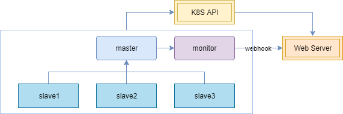
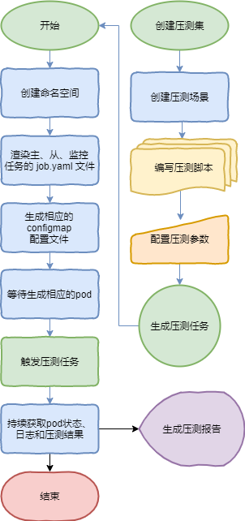
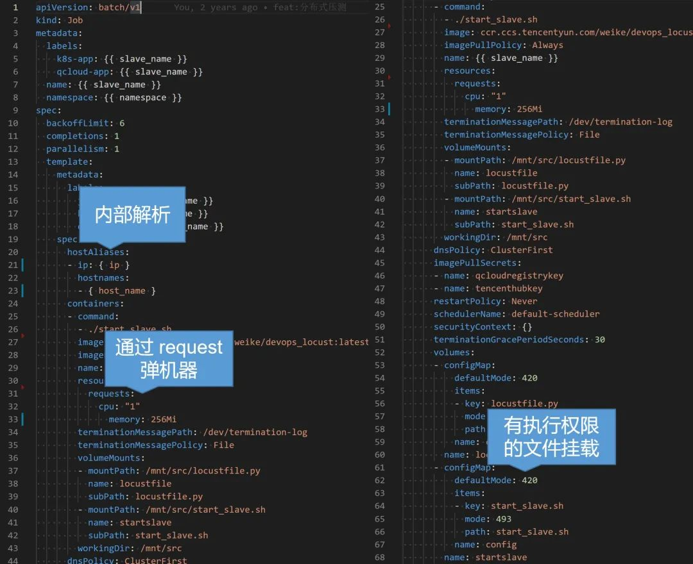
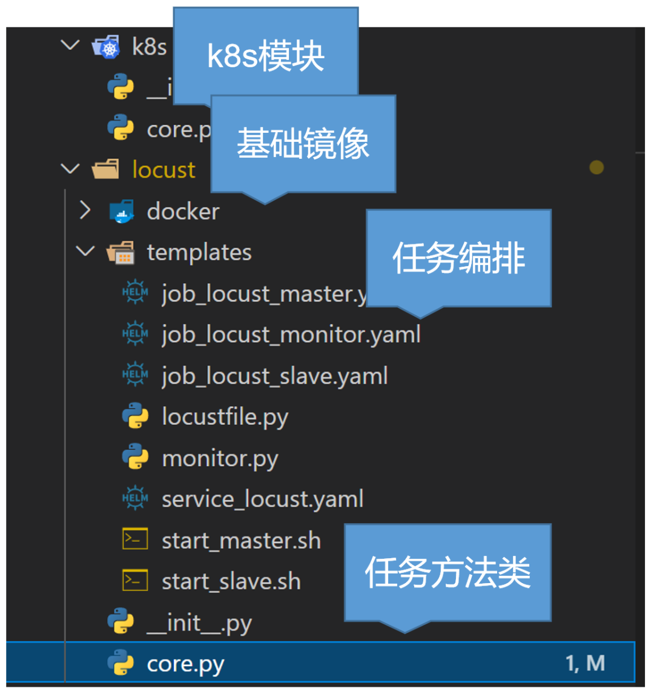
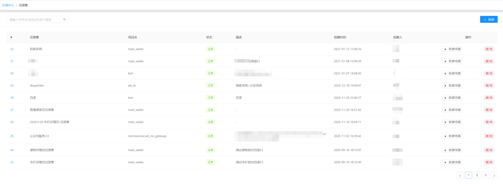
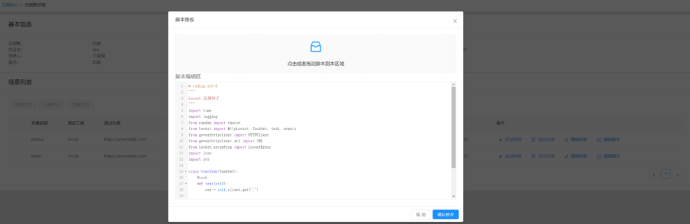
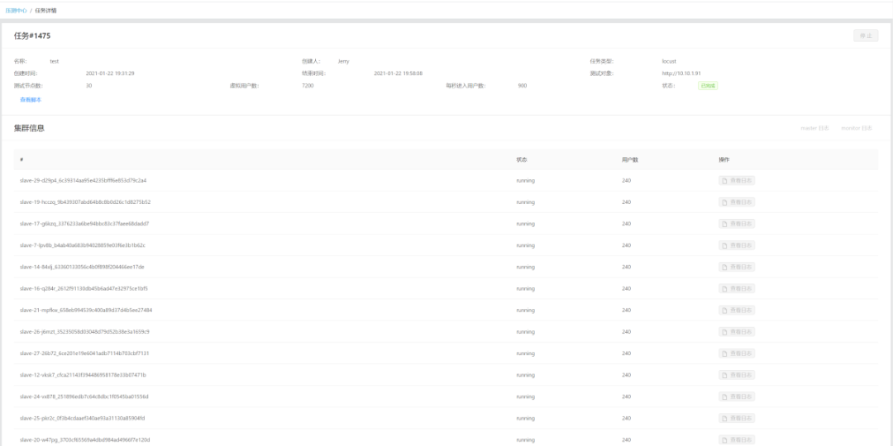
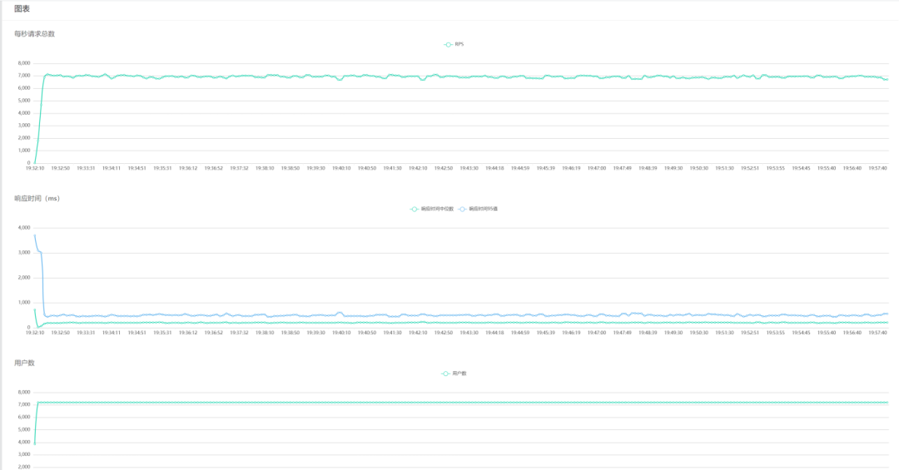

# 荔枝微课基于 kubernetes 搭建分布式压测系统


本文根据2021年4月10日深圳站举办的【腾讯云原生技术开放日】 线下活动中，荔枝微课基础架构负责人王诚强关于“基于 kubernetes 搭建分布式压测系统”的演讲整理而成。


大家好，今天想和大家分享的主题是基于 kubernetes 搭建分布式压测系统。从背景、原理、实现、效果和未来方向5个方面讲解了荔枝微课在基于 kubernetes 搭建分布式压测系统上的实践和思考。

### 背景
荔枝微课作为一个高速发展的平台，面临着业务流量越来越大的冲击，特别是在去年疫情期间遭遇成倍流量增长的情况，是通过什么方式轻松渡过难关的？以我在荔枝微课落地云原生的经历来说，为什么我们要去实践云原生架构呢？只是因为它是业内技术趋势吗？

其实这是源于业务需要的，基础架构最重要的是稳定高效，在我最早接手并负责荔枝微课基础架构时，第一个季度的目标居然是应急响应，但我们都知道应急响应是治标不治本的，而要治本根治的话那么就要对改掉整个底层基础架构，这也是为什么荔枝微课会去做云原生实践的原因。

而在做这个实践的时候，我们还需要一个工具来衡量，那就是分布式压测系统。我们早期使用过本地压测、CVM 伸缩组压测等方案，但是他们有着本地资源能力有限、伸缩组申请变更麻烦、伸缩速度较慢、压测脚本和报告管理混乱，经常无存档等缺点。于是我们采用了现在的基于 kubernetes 的分布式压测方案。

### 分布式压测方案借助的三个技术
原理上来讲，需要借助三方面的技术：

#### 编程技术
这里我们选择了我们团队较熟悉的 python，不同团队可以有不同的选择。

#### 压测引擎
我们用的是 Locust，因为它是用 python 写脚本，其实也可以更换成 jmeter 之类的其它压测引擎。

#### kubernetes
主要利用它的服务编排技术来进行一个资源上的调度，经过我们测试，如果是普通集群，在需要弹出集群物理节点的情况下，全部就绪需要90秒，但是使用弹性集群，则可以压缩到15~20秒，所以推荐使用弹性集群。

### 整体框架
整个技术框架原理上，压测节点分为主节点（master）、从节点 （slave）和监控节点（monitor）三种类型：

#### 主节点
负责任务管理和数据采集聚合，本身不进行压测任务

#### 从节点
负责压测任务

#### 监控节点
从主节点将结果通过 webhook 传递给 web 服务处理端；

另外这些节点的状态、日志都会通过 K8s 的 api 进行采集。根据压测任务里主从节点所申请的资源，集群将提前伸缩好节点，并将任务分配到不同节点，以达到动态提高压测能力的目的。

### 压测流程

右边为用户所感知到的过程，压测集中包括多个压测场景，通过编写压测脚本和配置压测参数的方式生成压测任务，并最终生成压测报告。

左边为 python 控制集群来生成任务的过程，具体是渲染生成不同任务的yaml 文件后，生成相应的 job pod，然后持续将 pod 状态 、日志和压测曲线结果反馈在页面上。

整个过程所使用的技术并没有多高深，主要是在集群应用上的一种探索。

### 实现方法
使用 yaml 编排 job 服务，举例 slave 节点来说，主要是声明一个 job 类型的工作负载，将生成的任务从节点名以及任务生成的命名空间渲染上去，然后设置我们的压测基础镜像以及启动命令，这里我们用到了 kubernetes 的几个技巧。一个是通过 hostAliases 进行内部解析，这样可以对一些内网代理进行压测，另一个是声明申请资源CPU，以便在任务启动前提前伸缩好物理节点提供资源，还有一个是通过 configmap 挂载可执行文件，这样可以注入参数在变化的启动命令，而不需要重新构建镜像。

然后说一下我们的代码框架，主要是分为这几个模块：

* K8s模块，提供一些如创建销毁命名空间或 pod、查看状态、拉取日志等api功能；
* 基础镜像，较为简单，主要安装了一些基础通用的库，然后开通了一些内部使用的端口；
* 任务编排声明文件，包括了我上面说的几种节点服务；
* 任务核心方法类，主要是将上述的流程代码实现，提供了一些方法，这里限于篇幅就不具体展开了。
然后最后我们来看下效果：

这是我们压测系统的管理界面，现在看到的是压测集，方便集中管理。

这是创建压测场景，并基于该场景编写 python 压测脚本，并可设置我们的任务参数。

这是压测任务详情页，可以看到压测参数、状态以及节点情况和查看日志。

这是压测过程中实时生成的图表，可以基于图表情况进行分析。

### 未来改进方向
* 引擎类型或版本允许选择更换；
* 批量定时分阶段的自动压测计划；
* 将所有涉及资源图表关联进来，形成更为详尽的报告；
* 任务资源限制与使用审批；
* 报告分析结论存档，相关问题追踪处理结果存档；
* 相同条件的多次压测结果对比展示；
* 使用更为云原生的方式管理任务的生命周期；

### Q&A环节
Q：这个压测系统对于测试人员的技能有什么要求吗？

A：需要会使用编程语言编写压测脚本，并有一定的分析思考能力，通过进一步封装的话也可以降低这部分的要求，但编程的话能力会更强更灵活，比如一些复杂条件或者像要动态使用账号的情况。

Q：我们公司的压测是每次压测之前申请一批虚拟机，压完之后销毁，这种自动化压测的方式还是能节省不少成本的。我想问一下，对于操作团队使用成本高不高？

A：我们这边的压测成本是不高的，因为压测任务，我们都是放在集群上的，也就是说我们用了多少才会去申请、才会弹出那么多。等压测任务结束后，它是自动释放的，我是把资源都销毁掉的。

Q：这个对于服务在哪个云有要求吗?

A：虽然我刚才说到的集群是 TKE 的，但 kubernetes 作为一项开源的、通用的标准化技术，只要能提供该服务的云，理论上都可以。

Q：你们压测会压生产吗？大概多久压一次？脏数据怎么办？

A：我们压测会在尽量不影响用户的情况下定期进行线上压测，大概是每月一次，新项目上线前也会在测试环境压，也有专门的压测集群来压，脏数据的话也是要清的，我们有机器人用户，可以针对这些用户进行脏数据清理。

Q：我们公司已经有用几台服务器来压测，想问下为什么要用 kubernetes 集群呢？

A：一方面我们当时刚好在做集群方面的实践，另一方面呢，也考虑了集群资源管理上的优势，比如资源隔离或限制，因为有的时候测试是不太清楚自己需要多少资源的，不加限制的话有的时候会占用比较多资源，还有就是任务状态、日志的收集还有就是我前面提到的一些集群的特性。

