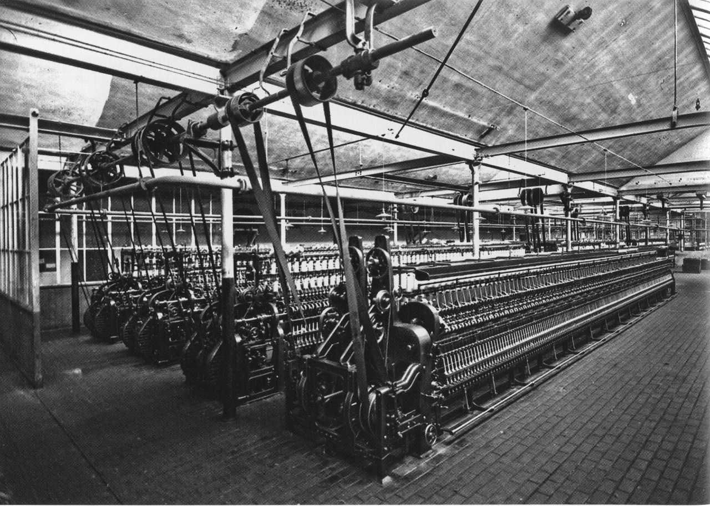

# AI 的天轴时刻——我们都把电动机装在了旧皮带上

> 19 世纪末的工厂把蒸汽机换成电动机，天轴和皮带原封不动。等了 40 年，人们终于拆掉天轴、改成单机驱动，流水线才诞生。AI 今天一模一样。

---

## 2018 年，律所，数据保护

2018 年，我参加一个律所办的数据保护法律分享会。坐在会议室里听律师们讨论 GDPR 的合规细节，脑子里想的全是"数据出境""用户同意""最小必要"——都是那个时间点最正经、最务实的 AI 法律问题。

从来没想过，有一天 AI 的社会形态变革问题会这样闯入我们的生活。不是以法律合规研讨会的方式，是以**结构**的方式。

前阵子翻工业史资料，看到一个词：**天轴**。

19 世纪末到 20 世纪初，工厂天花板下横着一根长铁轴。蒸汽机带动天轴旋转，天轴上挂满了皮带，皮带垂下来，一根一根连接到下面的机床——车床、钻床、冲床、织布机。蒸汽机一转，全厂跟着转。

我盯着这段描述看了很久。这不就是我们现在用 AI 的样子吗。

---

## 天轴时代：蒸汽工厂长什么样

先回到那个工厂。

1900 年，一家纺织厂。头顶是一根贯穿整个车间的钢铁主轴，直径可能有半米，长度超过一百米。这根轴叫天轴（line shaft），它的动力来源是厂房尽头的一台巨型蒸汽机。蒸汽机的飞轮转动，带动天轴旋转，天轴上每隔几米就挂着一组皮带轮，皮带从天花板垂下来，套在下面每一台机床的驱动轴上。

如果工厂有两层楼，皮带就从一个凿开的天花板洞里穿上去。为了防止火灾顺着洞蔓延，洞口外面要罩一个昂贵的"皮带塔"。整个系统用几千个滴油器持续润滑——油滴在旋转的轴上，甩得到处都是，空气里弥漫着机油和灰尘的混合物。

最恐怖的是安全。工人的袖子、鞋带随时可能被皮带或转轴卷入。在那个"大皮带时代"，少根手指是常见工伤。整根胳膊被拽进去送命的也不罕见。

更致命的是效率。蒸汽机不能停。哪怕今天只需要开一台机床，锅炉也得烧着，飞轮也得转着，整根天轴带着所有皮带空转。一台机器出问题，全线停工。每个工人的节奏都被天轴的转速锁死——你不可能比天轴快，也不可能比天轴慢。你可以是个好车工，但你的手速必须服从天花板那根铁轴。

动力从天上来，节奏从天上来——连工人的自由度，也归天花板管。

---

## 伪电气化：换掉了蒸汽机，没换掉天轴

1881 年，爱迪生在纽约珍珠街建了世界第一座商业发电站。第二年，电动机开始驱动工厂里的机器。

电气化来了。

但接下来发生的事情，和你想象的不一样。到 1900 年，美国工厂的机械动力只有不到 5% 来自电动机。蒸汽时代赖着不走。为什么？因为第一批"电气化"工厂做了一件事：把蒸汽机拆了，原地换上一台大电动机。天轴没拆，皮带没拆，布局没动，一切照旧。

**电动机取代蒸汽机，但天轴还是天轴。**

这不是假电气化——它是**伪电气化**。换了动力源，没换结构。

更尴尬的是，投资巨大，效果平平。到 1910 年，大量企业家看完了电驱动方案，算了算账，转身选了老式蒸汽。因为账单上省下来的那点燃料费，根本覆盖不了整套电气设备的投入。预期中的生产率大爆发没有来。来了一个 BBC 经济记者 Tim Harford 后来总结的那句话："在 1900 年，电气时代的观察者距离爱迪生的电灯和发电站（1879-1881）的时间距离，和我们今天距离 Intel 微处理器（1971）的时间距离一样远。"

那时候，电还是个噱头。

真正的变化要等到 1920 年代——距离电灯发明将近 50 年之后。其中原因，斯坦福经济史学家 Paul David 在 1990 年的一篇经典论文里讲透了。

---

## 不是技术不成熟，是脑子转不过弯

Paul David 的论文叫《The Dynamo and the Computer》。这篇被引用了 2700 多次的文章，试图解释一个当代谜题：为什么 1980 年代计算机到处都是，生产率数据却一动不动？1987 年，诺奖经济学家 Robert Solow 说了句著名的俏皮话："You can see the computer age everywhere but in the productivity statistics."

David 说，等等，这个事 100 年前发生过一次。对象是电。

他画了一条时间线：1879 年爱迪生发明实用电灯，1881 年建发电站，1882 年电动机进工厂。然后呢？然后沉默了 40 年。1920 年代，美国制造业生产率以空前绝后的速度飙升。你把功劳算在谁头上？电？电已经 50 岁了。David 的结论刺痛了一堆人：**1920 年代那场大飞跃的功臣不是新技术，是制造商终于学会了怎么用一项将近 50 年前的技术。**

学会的不是"怎么开电动机"。学会的是"电意味着什么"。

蒸汽机擅长的事和电动机擅长的事，完全不一样。蒸汽机越大效率越高，小蒸汽机是灾难——所以蒸汽工厂只能搞一个大块头，通过天轴把动力分配出去。但电动机大也行、小也行。每一台机床可以有自己的小电机。动力不再靠铁轴和皮带——靠电线。

这意味着什么？工厂不用再围着天轴建了。天花板不用再承重粗钢轴了。车间可以有窗户了，可以有自然光了，可以铺开了——单层、带翼楼和天窗。**布局逻辑从"天轴决定一切"变成了"流水线逻辑"。** 在老工厂里，蒸汽机定节奏；在新工厂里，工人定节奏。

但这一切的前提是——你不能只把蒸汽机换成电动机。你要拆天轴。你要重画工厂图纸。你要换掉从招聘、培训到薪酬的整个劳动制度。

> "Although all this was clear enough in principle, the relevant point is that its implementation on a wide scale required working out the details in the context of many kinds of new industrial facilities, in many different locales, thereby building up a cadre of experienced factory architects and electrical engineers familiar with the new approach to manufacturing."

Paul David 这段话翻过来就是：原理谁都知道，但把原理落成新工厂、新流程、新工种、新经验——这件事，花了 40 年。

---

## AI 的天轴时刻：我们在第几阶段

现在我们把这个镜头对准 AI。

三个数据，一一对应：

**1900 年：不到 5% 的美国工厂用上了电动机。**
**2025 年：根据 MIT NANDA 的报告，只有 5% 的企业从 AI 中获得了显著价值。** 95% 的企业——尽管买了 ChatGPT、装了 Copilot、搞了 AI 试点——P&L 表上什么都没动。Sequoia 的 Inference 专栏把这个叫"GenAI Divide"：5% 和 95% 之间的鸿沟不是投资额，是**有没有把 AI 接入核心业务流程。**

**1890-1920：电气化生产率停滞 30 年。**
**2020-？：Brynjolfsson、Rock 和 Syverson 在 2021 年提出了"生产力 J 曲线"——** 新技术引入初期，生产率不但不升，反而微降。因为企业在大量投入"无形资本"：重新设计流程、培训员工、重组组织。这些投入不进 GDP 统计，但它们是真正值钱的东西。当无形资本积累到足够的时候，J 曲线抬头。三位经济学家的原话是：AI 相关的无形资本效应"规模尚小但在增长"。

**1987 年 Solow 说：计算机无处不在，就是不在生产率统计数字里。**
**今天：AI 无处不在，就是不在生产率统计数字里。**

如果把这两张时间表叠在一起，我们现在大概在电气化故事里的 1910 年。**AI 已经不是噱头了，但大多数人对它的使用方式——还是电动机装到天轴上。**

---

## 当代天轴，长什么样

不用去工厂找。往办公室里看：

- **程序员。** Copilot 替你写了 80% 的代码，但你的工作流跟 2015 年没有本质区别——需求文档→设计评审→写代码→写测试→Code Review→CI/CD。AI 加速了"写代码"这个环节，但管线还是那条管线。IDE 还是那个 IDE。测试覆盖率、代码审查、上线流程、事故复盘——所有围绕代码的社会性结构，一个都没变。

- **内容团队。** 用 ChatGPT 生成大纲、改写段落、翻译文案。但选题会照开、层层审批照做、版本管理照旧。AI 帮你把初稿从 3 天缩到 3 小时，然后这 3 小时的产物在审批链上躺了 5 天。

- **客服部门。** 上了 AI 机器人，FAQ 被自动应答了。但客服人员的 KPI 还是响应时长和工单量，培训体系还是照着话术手册来，排班表还是没人动过。

- **企业 IT。** 采购了企业版 ChatGPT，全员一个账号、一套 Prompt 模板、一份使用规范。这不就是一根新的天轴吗——一套统一的 AI 入口，一条标准化的提示词皮带，把输出分发到每个工位。

还有一种天轴，连办公室都不用进。动力入口只有一个，拉闸权就在别人手里：显卡断供，训练任务就得停；账号被封，写了一半的上下文全断。以前蒸汽机一熄火，全线停工；现在断你的电不用进厂，一纸禁令就够了。

最精确的诊断来自 MIT 的 NANDA 报告，他们发现了一个叫"影子 AI 经济"的东西：大量员工自己掏钱买 ChatGPT/Claude 订阅，绕开公司 IT 系统来完成工作。为什么？因为公司配的 AI 工具没法适应他们实际的工作流。**员工在用脚投票，告诉你你的天轴是旧的。**

这跟 1910 年那些算完账后选了蒸汽机的企业家一模一样——不是电不好，是你用错了。

---

## 怎么判断自己在拆天轴还是换马达

一个自测问题：**用了 AI 之后，你的工作流拓扑变了吗？**

拓扑不变，只是某些节点变快了——这是换马达。拓扑变了——删掉了一些节点，新加了一些节点，甚至整个链路被重写——这是拆天轴。

举个例子。"写周报"这个事，如果 AI 只是帮你把 bullet point 展开成通顺的段落，拓扑没变。如果 AI 自动拉取你本周的代码提交、工单关闭、文档编辑记录，生成一份周报草稿推到你面前让你确认——拓扑变了。中间的收集、整理、格式化节点被删掉了。

再举一个。"代码审查"，如果你还是 PR→等人看→留 comment→改代码→重新 review，AI 只是帮你写个摘要，那没变。如果是 AI 先做一遍 review，标记了所有问题，人只做复核和 approve——拓扑变了。review 这个节点的内部结构被重写了。

拆天轴比换马达难得多。因为拆天轴不只是改工具——**是改流程、改权责、改 KPI、改组织结构、改你脑子里"这件事应该怎么做"的默认脚本。** Timo Elliott 总结了四个障碍，精准到可以贴在显示器上：

1. **沉没资本。** 你现在的管线和流程是花了很多钱和时间建的，你不愿意推倒重来。蒸汽工厂老板也不愿意报废那根钢铁天轴。
2. **技能缺口。** 拆天轴需要"工厂建筑师"和"电气工程师"——组织设计和 AI 工程的双料人才。这种人跟 1910 年的电气工程师一样稀有。
3. **文化阻力。** 天轴给了工厂一个统一的节奏，所有人都被锁在这个节奏里。拆掉天轴意味着给工人自主权——不是每个管理者都受得了。
4. **不确定的 ROI。** 你算不出这 40 年后的回报，但你算得出当下这笔投资的账单。这是人类面对所有 GPT（通用目的技术）时的永恒困境。

---

电从进工厂到真正改变工厂，花了将近 40 年。这 40 年不是技术在等，是人在等——等一代愿意拆天轴的工厂建筑师出现。AI 也会等到属于它的 1920 年代，区别只在于：那一次，被拆掉的是哪根轴。

下次你让 AI 按既定流程跑完一个任务、一切如常的时候，可以停下来问自己一个问题——

**我是不是只换了个马达？**

---

*下一篇：[《荷兰牧场与 AI 时代：别让旧思维束缚了想象力》](/posts/2026/07/19/dutch-pasture-ai-era/)——风车、水渠与笼头，AI 时代的第三种选择。*

