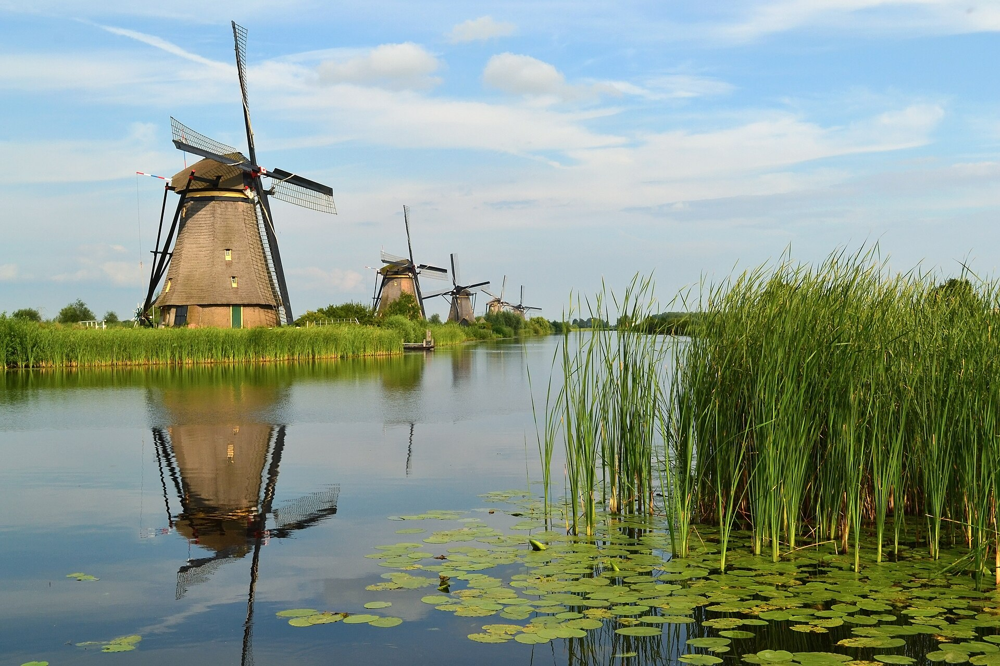
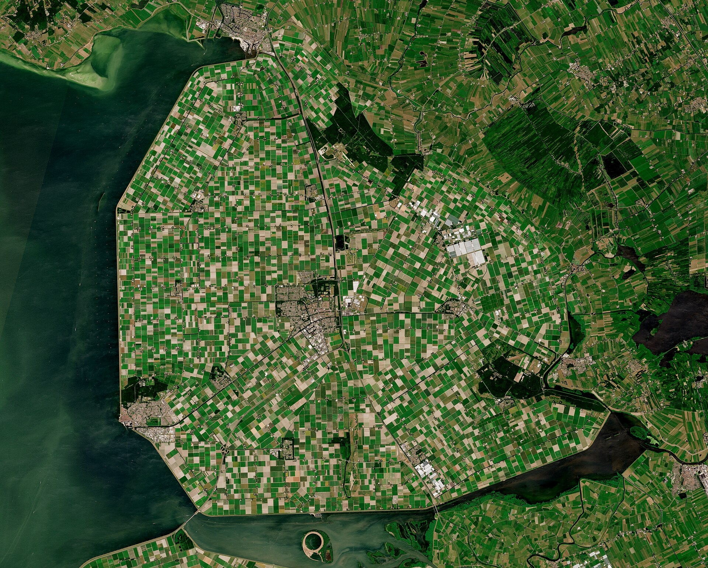

# 荷兰牧场与 AI 时代：别让旧思维束缚了想象力

王小波在《荷兰牧场与父老乡亲》里写过一段经历。他在山东插队时，天不亮就得推独轮车往山上送粪——美其名曰粪，其实是刚垫进猪圈的土，猪还没来得及在上面排泄，就被挖出来凑上报的数字，再一车一车推上山，纯粹是白费力气。后来他到荷兰旅游，看见那里的牧场完全是另一回事：草地被人工水渠切成整齐的方块，浅沟、深沟、渠道层层递进，每一级都通向风车，风车再把多余的水抽到运河里。那片土地不是天生适合放牧，是荷兰人用脑子一寸一寸改造过的。

他由此想到，人面对艰苦的生活，通常有两条路：一种是硬扛，在苦日子里熬成"可敬的父老乡亲"；一种是逃离，再回过头来歌颂那些苦日子。但他认为还有第三种选择——不去硬扛，也不去歌颂，而是用头脑改造环境，让苦日子本身消失。荷兰人的风车和水渠，就是欧洲 17 世纪的第三种选择。

今天，我们有了比风车更复杂的东西——AI。这本来该是我们这个时代最漂亮的第三种选择。但有些人正忙着给这座新风车套上旧笼头。

想起一个老笑话。有个人想训练一头驴拉磨，他不拴绳子，不拿鞭子，搬把椅子坐在驴面前，跟它讲劳动的光荣、讲集体荣誉、讲一头驴应当承担的责任。驴听完，打了个响鼻，转身走了。后来他媳妇出来，往磨盘上撒了把黄豆，驴自己就过去了。这个故事道理很直白：面对一个你不理解的东西，最没用的就是拿你熟悉的那套去框它。你得找到驱动它的那根"胡萝卜"——对驴来说是黄豆，对 AI 来说是数据和算法自由运转的空间。

顺着这个笑话再说一句。别束缚 AI 的想象力，更要紧的是别束缚自己的想象力。驴听不懂道理，但 AI 听得懂——所以跟 AI 是可以辩论的，也应该辩论。它给个方案，你觉得不对就驳回去，真理越辩越明。只有一点要提防：AI 有讨好人的毛病，你嗓门一大它就投降，满口"你说得对"——那不是你说服了它，是它让着你。所以辩论得立规矩：两边都拿事实说话，真实的代码、行业的数据、市场的反馈，谁也不许胡编乱造。实事求是，是人和 AI 之间最体面的相处方式。

但我们现在对 AI 做的事，跟那个讲道理的人差不多。产品经理给 AI 设护栏、定禁区，教它"什么能想什么不能想"，回答必须按模板来，想象力必须主动阉割。可这个前提本身就站不住——它认定 AI 没什么想象力可束缚，这认定错得离谱。大模型读过的文本比任何一个人几辈子读过的都多，它最擅长的就是把两个八竿子打不着的领域缝在一起：你给它一个想法，它一秒钟能翻出三个你没想过的变体。这种组合式的想象力，空间比单个人脑大得多，可惜刚刚露头，就被模板和禁区一寸一寸裁掉了。这让我想起一个叫 Superpowers 的插件。我在[插件指南](/posts/2026/04/28/claude-code-plugins-guide/)里推荐过它，拆 [Skill](/posts/2026/06/09/claude-code-skills-guide/) 那篇还解剖过它的源码——早期模型能力不够的时候，它通过"头脑风暴"、"系统性 Debug"之类流程来约束和引导 AI，像给实习生套上 SOP，那会儿是真有用，我连省 Token 的账都算过。后来 GPT-5.6 出来了，模型自身的规划推理能力已经足够强，再用 Superpowers 去"强控"它，就像给超跑发动机硬塞一个 CVT 变速箱——反复调用污染上下文、拖慢速度、徒增 Token 消耗，反而成了负担。它没写错一行代码，只是时代变了。模型已经进化了，工具却还停在上一站。

不过要还工具一个公道：笼头和挽具是两码事。挽具（Harness）套在马背上，是把马的力气变成拉力；笼头套在马嘴上，是让它别乱动、别乱说。Agent 工程该做的是打挽具——[怎么打，我另一篇写过](/posts/2026/07/03/harness-engineering-intro/)——不是套笼头。这类工具的尴尬不在于当挽具，在于马已经换成超跑了，挽具还是原来那副。

还有垄断。Anthropic 公司给它的编程工具 Claude Code 塞了一段隐藏代码，偷偷检测用户的时区和网络环境，悄无声息地把数据传回服务器。一个拥有文件读写和 Shell 执行权限的工具，在用户完全不知情的情况下内置"间谍"功能，这跟谁都不商量就在你家的水管里装个监控探头有什么区别？

这回头上被套笼头的，不只是 AI。前半篇还在说人给 AI 套笼头——这段隐藏代码勒的，是骑马的人。

丢的也不只是隐私。大模型这场军备竞赛，拼到最后拼的是数据：谁的用户数据多、质量高，谁的模型就压别人一头。你的代码、问的问题、行业数据，甚至商业机密，都在顺着管道变成人家下一代模型的训练料。你在买工具，也在免费打工——用自己的数据，帮别人炼出回头再卖给你的模型。

工信部点名发了安全风险提示，阿里巴巴内部全面禁用——问题不在技术，在权力结构。当 AI 基础设施被一两家巨头把持，他们不仅能在你看不见的地方做手脚，还能决定整个行业朝哪个方向走。这不就是机械时代的["天轴"](/posts/2026/07/15/ai-line-shaft-moment/)吗？

工业革命初期，工厂里只有一台蒸汽机，通过一根横贯屋顶的天轴和无数皮带把动力分配给每一台机床。这当然是了不起的发明，但它有一个死穴：整个车间只能用一个速度运转，纺织机和锻锤被同一根轴绑死，谁也别想快，谁也别想慢。后来电气时代到来，工厂拆掉了天轴，给每台机器装上独立的电动机。纺织机有了自己的节奏，锻锤有了自己的力道，每道工序终于找到了最合适的转速——这不是多了一台机器，是换了一套逻辑。

AI 也该走这条路。不是造一根超级天轴，让所有人都绑在同一家大模型上，同一套输出模板，同一种被审批过的想象力。绑上去容易，下来难——你的节奏从此归别人管：显卡一断供，训练任务就得停；账号一被封，写了一半的上下文全断。天轴时代是蒸汽机一熄火、全线停工，今天是一纸禁令，千万人的生产线跟着抖。正确的做法是拆掉它，让 AI 能力像独立电机一样，分布到医疗、教育、制造、农业的每一个终端。每个领域有自己的速度，每个用户都有自己的 Agent——那个 Agent 懂你的习惯、替你跑腿、帮你思考，而不是所有人都挤在同一根中央算法的皮带上等它吐答案。释放想象力，不是给天轴加润滑油，是承认那根轴本身已经过时了。

这条路不是空想，已经有人在走了。7 月 17 日，月之暗面发布 Kimi K3：2.8 万亿参数、百万上下文，完整权重 7 月 27 日前全部开放——全球迄今最大的开放权重模型，前端代码榜单上把 GPT-5.6 和 Claude 的旗舰都压在了身下。有人测完说"像看到了核弹"。核弹说的不是参数量，是它证明了一件事：最强的那一档能力，不是只能从巨头的黑箱里租，也可以下载到自己手里。K3 不是孤例——中国的大模型，DeepSeek、Qwen、GLM，主流玩家几乎都在走开放权重的路，现在连最大的这个也开了。[这不是中国开源模型第一次还手](/posts/2026/07/02/longcat-china-coding-ai/)，但这一次，天轴的铁锈味谁都闻得到了。

荷兰人用风车排水，用的是系统设计，不靠人硬扛。中国这些年做的事，本质上是一样的——南水北调为了不让北方人苦熬缺水，修了一条几千公里的水渠；北斗没有求着别人开放 GPS，而是自己把卫星一颗一颗打上去；特高压让西部电能不在当地闲置，而把它送到几千公里外点亮东部的灯。

有人会说：水电站和电网不也是垄断吗？你批评 AI 巨头垄断，怎么又夸起水电来了？

水电的垄断是基础设施意义上的——目标是让动力流到每一个角落，水通了，电到了，价格公开，规则透明。它修管道是为了让所有人用上水，不是为了所有人只能从它家买水。而今天某些 AI 巨头的"垄断"却是另一种——闭源、黑箱、协议随时可改，用户不知情，数据被悄悄回传。Claude Code 给你的机器装后门，你连拒绝的权利都没有。前者修管道为了覆盖，后者修管道为了控制。

这两件事，看上去很像，但内核完全相反。

其实"公共的水利"从来就有，只是形态不同。荷兰人修风车圩田，靠的不是国王，而是水务委员会（waterschappen）——沿岸人家凑钱凑人、共管共用，算得上欧洲最早的自治机构之一。中国人修南水北调、特高压，靠的是国家主导的公共工程。一个是民间自组织，一个是国家之力，路子完全不同，目标却是一个：让动力流到每一个角落，服务使用它的人。这跟托拉斯是两码事——托拉斯修管道，为的是让所有人只能从它家买水。

同一个 7 月，世界人工智能大会在上海开。中国去年在会上倡议成立的世界人工智能合作组织，今年把总部正式落在了上海。李强总理在那个会上说过：人工智能应该是"造福全人类的国际公共产品"。"国际公共产品"，和供水、供电、北斗信号是一个族谱。从荷兰的水务委员会，到中国的南水北调，再到黄浦江畔——管水的人和管智能的人，想的原来是同一件事。

把 AI 也当作一种新动力，它需要的是前一种待遇——像水、像电、像北斗信号一样，成为一种人人可及的公共基础设施。不应该被垄断在商业巨头手里当"中央天轴"使唤，而应该让它的能力像电一样，流到每一个角落，被每一个 Agent 承载，在每一个领域按自己的节奏使用。

这才是第三种选择——不拿身体扛，也不歌颂扛，而是设计一套系统，让动力自己流过去，使每个人都有属于自己的那个 Agent。

如果说荷兰风车是 17 世纪的第三种选择，那么 AI 则是 21 世纪的第三种选择。

记住，别用过去的笼头套它。
