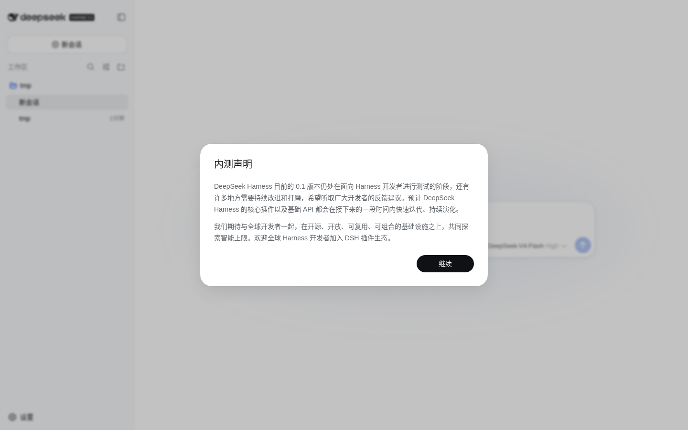
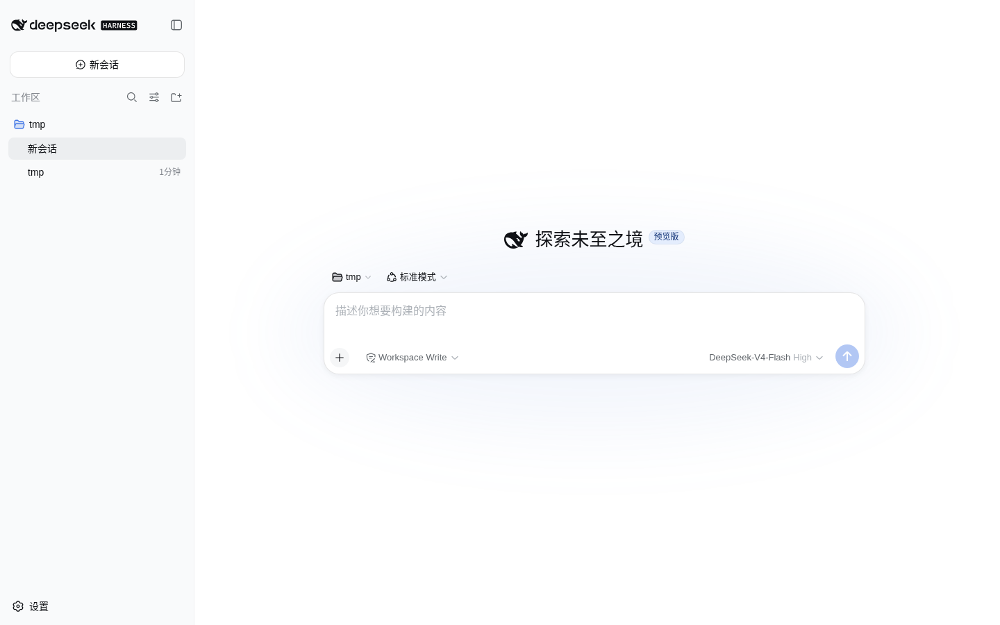
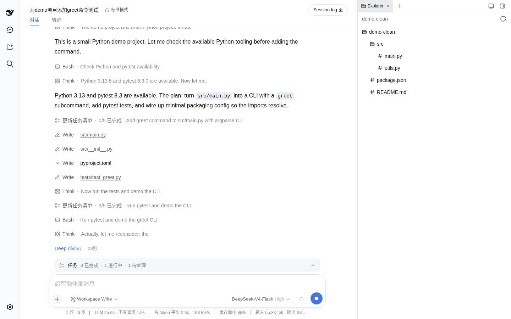
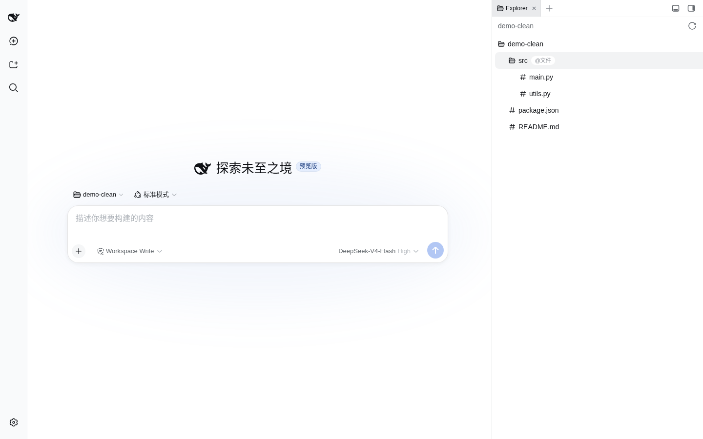
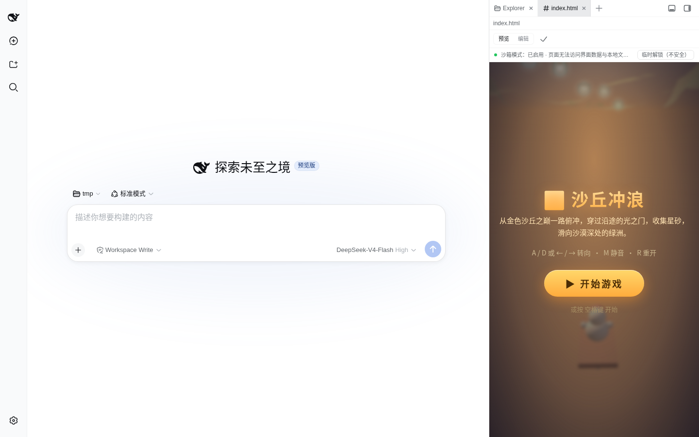

# DeepSeek Harness 实测：开源当晚破 3 万 star 的 Agent 运行时


## 一、上手：五分钟跑通

安装就一条命令，Node.js 装好后：

```bash
npx @deepseek-ai/dsh web
```

默认起在 `http://127.0.0.1:3080`。第一次打开，先弹出一份"内测声明"——**"DeepSeek Harness 目前的 0.1 版本仍处在面向 Harness 开发者进行测试的阶段"**。注意这个措辞：面向 Harness 开发者，不是面向普通用户。这是整件事的题眼，后面再展开。



命令行模式更快验证链路：

```bash
dsh --profile headless "用一句话说明什么是 RPC"
```

**1.2 秒后首 token 到达，125 tok/s**，回答正确。模型用的是 DeepSeek-V4-Flash，环境变量里的 key 直接被识别。跑通本身毫无门槛——门槛在后面。

## 二、第一印象：像 Codex，但处处露出"框架"的底子

界面乍看和本地 Agent 产品没什么两样：左侧会话列表、中间对话区、顶栏有模型选择（DeepSeek-V4-Flash）和推理等级（Off / High / Max）。

但细看全是"框架思维"的痕迹：

- **四种 Agent 预设**：标准模式（完整编码 Agent）/ PTC 模式（模型写 TypeScript 编排多步工具调用）/ 极简模式（只有 bash + 文件编辑两个工具，官方用它跑自家模型的基准测试）/ 创造模式（让你在内存里捣鼓插件、自己造预设）。"极简模式用于模型基准测试"——**官方评测自家模型用的就是这个 harness**，V4 Flash 的更新日志里写过这句话
- **模型市场**：默认接入近 40 家第三方模型（Kimi、OpenAI、Anthropic、Google……），模型只是插件
- **"一切皆插件"**：工具、模型适配器、提示词、存储、UI 区域，都是插件



## 三、实测一：Three.js 小游戏，慢，但它在自我验收

此前有媒体用"滑沙游戏"任务横评过 DSH / Reasonix / Codex 三家。我们复刻了同款任务：

> 创建一个 Three.js 滑沙小游戏，单文件 index.html：玩家从沙丘顶端下滑，穿过沿途的门，抵达沙漠绿洲。

**首先，它真的很慢。** 任务跑了 10 分钟还停在"进行中"，这是状态栏（实时数据）：

```
1 轮 · 20 步 | LLM 7m15s · 工具调用 3m26s | 缓存命中 99% | 输入 1.1M tok · 输出 50.8K tok
```



**输入 1.1M token**——它把整个游戏代码、截图分析结果、探针输出全部喂给了模型反复检查。DeepSeek 的长思考模型 + 反复验证 = 半小时级任务（此前媒体横评也观察到了同样的现象）。

**但慢得有道理：它不是在"写一遍就交差"，它在自我验收。** 会话轨迹里可以看到它干的事：

1. 生成游戏 → 自己截图 → **分析像素颜色**，然后发现自己的颜色分类逻辑有 bug（"teal 桶里其实是天空像素，b>g>r 的蓝色被算成了水"）
2. 对比三张截图的**文件哈希**，确认动画真的在推进（"帧确实在变，只是场景主体都是沙丘导致颜色分布相近"）
3. 写了个探针把游戏状态写进 `document.title` 配合无头浏览器虚拟时间测量物理推进——然后发现 **headless 下虚拟时间与真实时间比例约 8:1** 的坑，自己调整预算继续测

这不是"生成完就交差"的 agent，是**真的在对自己产物做质量验收**的 agent。这种"验收闭环"（生成 → 实测 → 发现缺陷 → 调整策略）是执行层能力的直接体现：**当模型完全相同时，Harness 提供的工具、提示词、上下文组织和执行策略，足以显著改变最终产物**——这一点我们实测同样成立。

产物本身：40KB 单文件，headless 浏览器打开渲染正常（canvas 正常、无 JS 报错），点击即可开始。下面三帧是同一局游戏的不同时刻（每 5 秒一帧）——沙丘、蓝天、光线变化说明它真的在跑：


## 四、意外收获：审批机制，和"写工作区外"的真实教训

第二个任务想让它建一个 Python 命令行 todo 工具（加功能 + 写测试 + 跑通），**指定了工作区之外的目录**。然后任务就挂起了——不是失败，是**卡在审批上**。

查看会话日志（事件溯源，见下节），一切都有据可查：

```
{"type": "approval/policy", "seq": 2, "data": {"policy": "ask"}}
...
{"type": "approval/asked"}   ← 写工作区外，触发审批，无人审批，任务挂起
```

**默认策略是 ask**：涉及工作区之外的写入，模型不能自作主张，必须人点"允许"。headless 自动化没有审批人，任务就永远挂着。这对想做无人值守自动化的团队是个真实提醒：**DSH 的权限边界是硬约束，不是摆设**——而它的策略状态（workspace-write / ask）是直接写进会话日志的，重启不丢（详见下节）。

## 五、插件实测："一切皆插件"不是口号，6 小时长出 IDE 级生态

开源当天，社区就出了一个叫 **dsh-better-sidebar** 的插件（发布在 npm，一条命令安装）：

```bash
dsh plugin --profile web add dsh-better-sidebar
```

装完重启，侧边栏从"会话列表"变成了一个完整的 **Explorer 文件树**（懒加载目录、右键复制路径、`@文件` 引用到输入框）。点开一个 HTML 文件：



- **CodeMirror 6 编辑器**打开，可直接编辑、Ctrl+S 保存
- 切到预览：**沙箱 iframe 渲染**，顶部有状态提示——"沙箱模式：已启用 · 页面无法访问界面数据与本地文件，登录态与第三方 Cookie 可能不可用"，并提供"临时解锁（不安全）"按钮



这个"预览即沙箱、解锁有红警提示"的设计，比很多正式 IDE 的预览器还谨慎。而这个插件还带：内嵌浏览器、xterm 真实终端（node-pty）、Git 面板（真 diff + 右键暂存/提交）、后台任务拓扑视图、移动端适配——**一个社区插件就是一套迷你 IDE**。

安装过程中也踩到 README 预警的坑：pnpm 的 `strict-dep-builds` 拦了 node-pty 的构建脚本，需要 `pnpm approve-builds --all` 放行。README 一字不差地预告了这个坑——插件文档的成熟度也是"社区已形成"的证据。

**"一切皆插件"的验证结论：真的。** 工具是插件、模型是插件、UI 是插件、连侧边栏都是插件——而且 6 小时就有第三方把它改成 IDE。这种扩展性上限，一体式产品（Codex 没有插件体系）给不了。

## 六、会话与数据：事件溯源，眼见为实

dsh 架构里最值得实锤的一点，这次实测直接看到了实据。磁盘上的会话是这样的：

```
~/.dsh/sessions/--tmp--/<session-id>/session.jsonl.zstd
```

zstd 压缩的 **append-only 事件日志**，每个会话一个目录。解压看一次完整对话：

```
{"type": "session", "cwd": "/tmp", "agentPreset": "standard"}      ← 会话头
{"type": "permission/preset", "data": {"preset": "workspace-write"}} ← 权限是事件
{"type": "sandbox/mode", "data": {"mode": "workspace-write"}}        ← 沙箱是事件
{"type": "approval/policy", "data": {"policy": "ask"}}               ← 审批策略是事件
{"type": "user/message", "data": {"text": "测试发送：回复OK"}}
{"type": "request/header", "data": {"model": "deepseek-v4-flash"}}  ← 实际请求的模型也记录
{"type": "reasoning-chunks"}                                        ← 思考过程
{"type": "assistant/chunk"}                                         ← 流式输出
{"type": "turn/end", "data": {"reason": {"kind": "completed"}}}
```

**系统提示词、思维链、工具调用与结果、模型请求头、审批策略——全部在日志里，模型看到的一切都来自这条日志的派生。** 实测里我们重启过服务、中断过任务，会话一条没丢：磁盘上 4 个会话完好。这就是"恢复、分叉、回放共享同一份事件流"的实据——**不是产品文档里的承诺，是磁盘上能数出来的文件**。

## 七、结论：它是基础设施，不是又一个 Codex

这一轮实测下来，我们自己的结论是：

- **它确实不是 Codex 的竞品**。Codex 交付的是"拿来即用的 Agent"；DSH 交付的是"组装 Agent 的运行时"——预设、profile、插件、事件溯源，它把大量结构暴露给你，让你自己决定 Agent 是谁。用它的官方公式：**Agent = Model + Harness**，模型是灵魂，Harness 是让模型在真实场景持续工作的能力。它是**基础设施**，不是产品
- **惊艳的地方**：插件生态的上限（6 小时长出 IDE 级插件）、事件溯源的彻底性（策略状态都进日志）、agent 的自我验收闭环
- **劝退的地方**：慢（半小时级任务 + 1.1M token 输入）、无 TUI（交互前门只有 Web）、配置门槛（模型、预设、权限都要自己摆弄）、预览版说变就变（rc.5 明确"THERE WILL BE COMPATIBILITY-BREAKING CHANGES"）
- **给自动化用户的提醒**：权限边界是硬约束，无人值守场景先解决审批（策略从 ask 改成更宽松的模式，或补审批人）

DeepSeek 过去最受关注的是模型；harness 是它第一次处理"模型之外"的问题：工具如何组织、上下文如何保存、执行过程如何留痕、同一套系统里如何跑不同的 Agent。**"Agent 和模型同样是基础设施"**——这句话能不能成立，取决于接下来一个月它的插件生态和 1.0 的稳定性。我们按模式跟踪，不按版本追车。

---

*附：本文全部实测基于 dsh 0.1.0-rc.6（npm 发布版），环境为 Linux + Node 22 + DeepSeek-V4-Flash。文中截图均为实测截取。*

