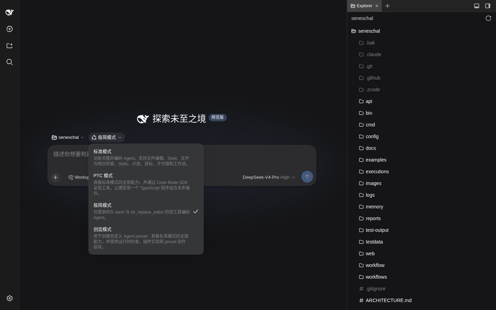
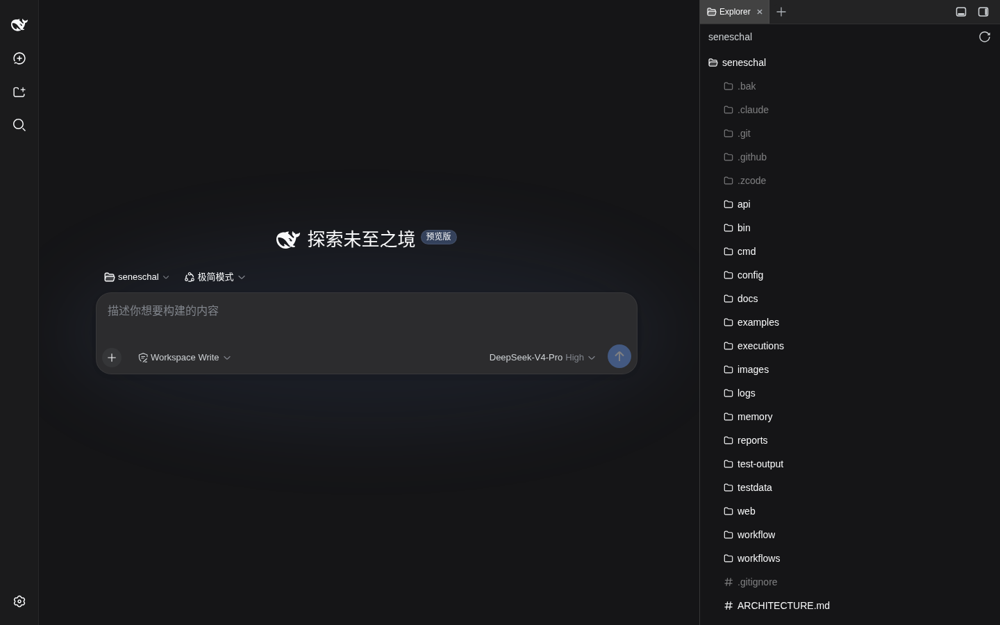
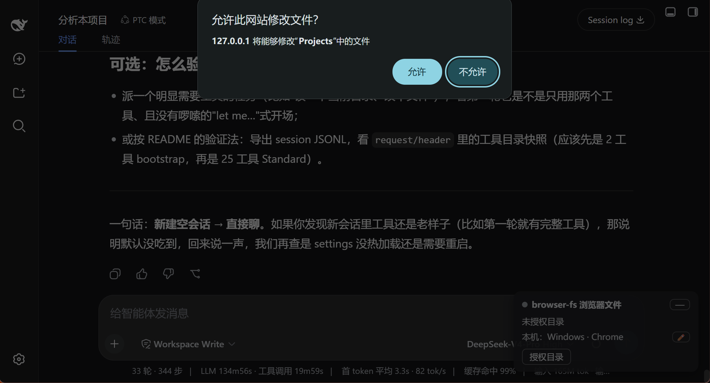

# 给 DeepSeek Harness 写插件：让远程 Agent 读写你电脑上的文件


## 一、一个真空地带

DeepSeek Harness（dsh）开源后插件爆发，目录站收录几天破千。但翻一遍会发现一个空白：**所有文件类插件操作的都是 dsh 宿主机的磁盘**。

这在"dsh 跑在自己电脑上"时无所谓。但一旦你把它部署到服务器、用手机或另一台电脑的浏览器访问，Agent 能读写的就只有那台服务器——你手头这台电脑上的文件，它一个也碰不到。已有的最接近的方案是手动上传（`dsh-file-uploads`：把文件传进宿主容器），那是一次性动作，不是"Agent 直接读我的项目目录"。

所以我写了 `dsh-browser-fs`：在 dsh 页面里授权一个本地目录（浏览器 File System Access API），Agent 就多了三个工具——`browser_fs_list` / `browser_fs_read` / `browser_fs_write`，读写的是**你浏览器这台电脑**。

这篇文章是它的完整开发记录。dsh 的插件文档目前很薄，真正的知识都在源码里，我把拆解过程一并写出来。

## 二、先搞懂 dsh 插件系统

### 一切皆插件，包括它自己

dsh 基于 Cordis 元框架，"everything is a plugin" 不是口号：连它的 HTTP 服务器（`webserver`）都只是一个 266 行的插件，静态资源服务、API RPC、WebSocket 事件流都是挂在上面的注册项。这带来一个好消息：插件能摸到系统的一切；一个坏消息：文档追不上代码，看源码是最快的学习方式。

### 插件的物理形态

一个可被 `dsh plugin --profile web add` 安装的插件 = 一个 npm 包 + 两个声明：

```jsonc
// package.json
{
  "name": "dsh-browser-fs",
  "type": "module",
  "exports": {
    ".": "./lib/index.js",        // host 半（Node 进程里跑）
    "./client": "./lib/client.js" // client 半（浏览器里跑）
  },
  "dsh": {
    "bundle": { "patch": "./cordis.patch.yml" }, // 挂载配置
    "client": { "platform": "web" }              // 声明有浏览器半
  }
}
```

```yaml
# cordis.patch.yml：把自己的行插进 Cordis 树
- insert:
    - id: browser-fs
      name: 'dsh-browser-fs'
      config: { wsPath: '/browser-fs/ws', requestTimeoutMs: 120000 }
```

生命周期骨架是 Cordis 标准式：`export const inject = ['webServer', 'tools']` 声明依赖的服务，`export function apply(ctx, config)` 里注册一切，资源回收走 `ctx.effect()`。

### 创造模式是什么

插一句很多人问的：dsh 四个内置 preset 里的「创造模式」（cordis preset）就是官方给插件作者的辅助模式——标准模式的全部能力，外加运行时检查、插件实验和 preset 创作指导。



两条开发路线都成立：用创造模式让 dsh 帮你写（自举），或者源码调研后手写。我这次选了后者——不是创造模式不好，而是我要的 API 事实（client 侧能否注册工具这类）必须看代码才能确认，AI 辅助调研源码+手写实现反而更快。

## 三、关键结论：必须做"双面插件"

这是整个开发里最重要的架构判断，也是 README 里找不到的事实：

**dsh 的模型工具只能在 host 侧注册。** `ctx.tools.register(defineTool({...}))` 注册的工具，其 `execute` 函数运行在 dsh 宿主的 Node 进程里。浏览器侧的 client bundle 没有任何"注册模型工具"的入口。

那浏览器的能力怎么给模型用？dsh 自己早有答案——`ask_user_question`（模型主动向用户提问）就是"host 注册 + 浏览器执行"的双面结构，只是它走的事件流通道是 apiproxy 私有的，第三方插件复用不了。我用公开 API 复刻同样的架构：

```
模型调用 browser_fs_read
  → host 半工具的 execute()（dsh 进程）
  → 自建 WebSocket 通道（webServer.registerUpgrade）
  → 浏览器 client 半执行 File System Access 操作
  → 结果沿 WS 回到 host → 回到模型
```

WS 通道上跑自己定义的帧协议：`call`（host→浏览器，带 rpcId 和参数）、`result`（浏览器→host，按 rpcId 配对）、`cancel`（中断传播）、`state`（浏览器上报"我有没有授权句柄"）。

## 四、实战：dsh-browser-fs 走查

最终结构：

```
dsh-browser-fs/
├── package.json / cordis.patch.yml / build.mjs
└── src/
    ├── index.ts      # host 半：WS 中继 + 三个工具注册 + roster 广播
    ├── wire.ts       # 帧协议与两侧校验（state/call/result/roster）
    └── client/
        ├── index.ts  # 入口：WS 客户端（断线重连）、call 分发、特性检测降级
        ├── fs.ts     # FsBackend 抽象 + 完整模式句柄后端
        ├── files-backend.ts  # 兼容模式：webkitdirectory File 映射（只读）
        ├── preview.ts # 预览纯函数（类型判断/截断/二进制嗅探）
        ├── device.ts  # UA 派生设备名
        ├── store.ts  # IndexedDB 句柄持久化
        └── ui.tsx    # 授权卡片 + 目录树（文件预览/刷新按钮）
```

> 后记：初版只有「句柄后端」一条路。手机局域网 http 场景下 File System Access API 整个不可用（安全上下文门控），后来补了 FsBackend 抽象 + 兼容模式；多设备同时在线时的「当前授权在哪台设备」可见性也是后加的。演进细节见同系列《把 dsh 开放到局域网》一篇。

### host 半：工具 + WS 中继

三件事：起 WebSocketServer（挂在 `registerUpgrade` 注册的路径上）、维护 `pending` 映射（rpcId → resolve/reject）、注册工具。工具的 `execute` 把参数广播给在线浏览器，然后 `await` 对应 rpcId 的结果帧：

```ts
ctx.tools.register(defineTool({
  name: 'browser_fs_read',
  description: '读取用户浏览器所在电脑上、已授权目录下的文本文件',
  parameters: { path: { type: 'string' }, maxBytes: { type: 'number' } },
  output: { schema: ..., render: (args, v) => [textBlock(v)] },
  async execute(args, exec) {
    // exec.signal 接到 pending：会话中断时 WS 等待一并取消
    return relay.call(exec, 'read', args);
  },
}));
```

没有浏览器在线、或在线浏览器没授权目录时，立即返回明确的错误结果（让模型知道该叫人去授权，而不是傻等）。

### client 半：File System Access 执行器

浏览器侧核心是三个操作，全部限定在用户授权的目录句柄之下——沙箱由浏览器强制，代码层面再加一道 `..` 逃逸检查：

```ts
// 授权（必须由用户手势触发）
const handle = await showDirectoryPicker({ mode: 'readwrite' });
await saveHandle(handle); // 存 IndexedDB，下次启动读回 + queryPermission()

// list / read / write 都是 FileSystemDirectoryHandle 的标准操作
const dir = await resolveDir(handle, args.path); // 逐级 getDirectoryHandle
for await (const entry of dir.values()) { /* ... */ }
```

`read` 默认上限 256KiB 并标注截断；`write` 自动创建父目录、返回写入字节数。

### client bundle 的构建契约

浏览器半不是普通 npm 包，dsh 的模块加载器要求：

- 产物固定 `lib/client.js`，CJS 闭包
- 首尾包装 `window.__ModuleLoader__.load({ id, factory })`
- external 只允许平台模块（react、cordis 等少数几个），其余依赖全部 inline

官方构建 preset 没发布成包，我用 esbuild 三十几行配置复刻了这个契约（`banner`/`footer` 注入包装）。

## 五、四个坑（README 不会告诉你的）

1. **npm registry 超时**：国内装依赖记得配镜像（项目里放 `.npmrc` 指向 npmmirror；`dsh plugin add` 内部走 pnpm，用 `npm_config_registry` 环境变量带过去）。
2. **句柄不能序列化**：FileSystemDirectoryHandle 只能存 IndexedDB，走不了 dsh 的 settings 服务（而且 settings RPC 在非 loopback 访问时被官方钉死禁用）。
3. **WS 路由不过信任栅栏**：`registerUpgrade` 挂的路径不走 `/api` 的 Host/Origin 检查，自己的 handler 里要补同源校验（我的规则：Origin 存在则必须与 Host 同源，缺失放行——和 dsh 官方栅栏同款语义）。
4. **安全上下文**：`showDirectoryPicker` 只在 HTTPS 或 localhost 可用。`http://192.168.x.x` 局域网访问时这个 API 直接不存在，polyfill 都救不了（这类权限级 API 和 `crypto.randomUUID` 不同，补不出来——上一篇《手机访问局域网服务就白屏？》详细讲过这个坑）。

## 六、装机与验证

安装一行命令（file: 依赖是打包拷贝，改动后要重装+重启 dsh）：

```bash
dsh plugin --profile web add file:/path/to/dsh-browser-fs
```

验证清单：boot manifest 出现 `browser-fs/client.js?rev=...`；`/plugins/dsh-browser-fs/client.js` 返回 200；WS 路由返回 426（等 upgrade）；真实 WS 握手同源 101 / 跨源 403；链路自检脚本 10/10（工具注册、参数校验、无授权报错、断连中断、list/read/write 全往返）。



最后一步只能真人完成：`showDirectoryPicker` 是系统级弹窗，自动化点不了。在 `localhost:3080` 打开页面，授权卡片里选一个目录，然后对 Agent 说"列出我授权目录里的文件"——它会调起 `browser_fs_list`，读的是你这台电脑。



注意新版 Chrome 在选完目录后还会再确认一次写权限（上图的「允许此网站修改文件？」——因为我申请的是 readwrite 模式）。这层"每步都经过你"的授权链，就是这个插件的安全边界。


## 七、限制与边界

- 浏览器标签页必须开着，工具才能执行（架构使然）
- 多个标签页/设备在线时，由第一个持授权句柄的执行者干活（roster 帧让每台设备可见「当前授权在哪」）
- 完整模式仅 Chrome/Edge 等 Chromium 系（File System Access API 的浏览器覆盖现状）；**非安全上下文**（手机局域网 http）自动降级「兼容模式」——`webkitdirectory` 快照、只读、页面刷新需重选；iOS 目录选择返回 0 文件，故授权区提供「选择目录 / 选多个文件」双入口（安全上下文细节见同系列《把 DeepSeek Harness 开放到局域网》一篇）
- 目录树文件名点击出预览：文本前 64KB 截断、图片 ≤8MB 走 blob URL、二进制只提示不支持；「↻」刷新按钮在完整模式清缓存重拉，兼容模式下等价于重新选择目录
- dsh 处于 rc 阶段、无兼容承诺，`defineTool`/`registerUpgrade` 这些 API 面未来可能漂移——好在我的接触面很窄，跟起来不难

## 八、资源

- 插件仓库：[github.com/whitefirer/dsh-browser-fs](https://github.com/whitefirer/dsh-browser-fs)（本文所有代码）
- 必读源码：`packages/core/tools`（工具注册）、`packages/host/webserver`（HTTP/WS 注册口）、`packages/client/connection/src/websocket-downlink.ts`（WS 服务端模板）、`packages/client/ui-user-questions`（双面插件的官方先例）
- 插件目录站：awesome-dsh-plugin / Oh-My-DSH / dsh-plugin-directory（投稿入口都在）

