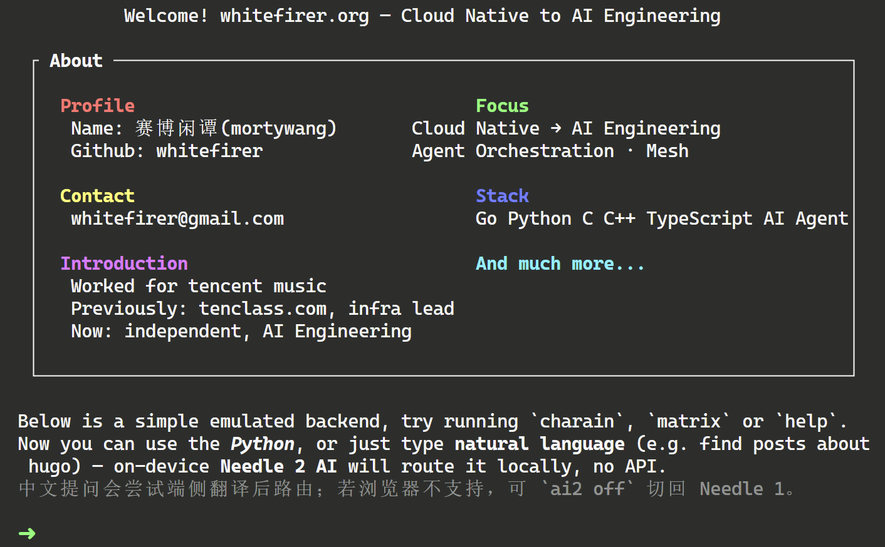
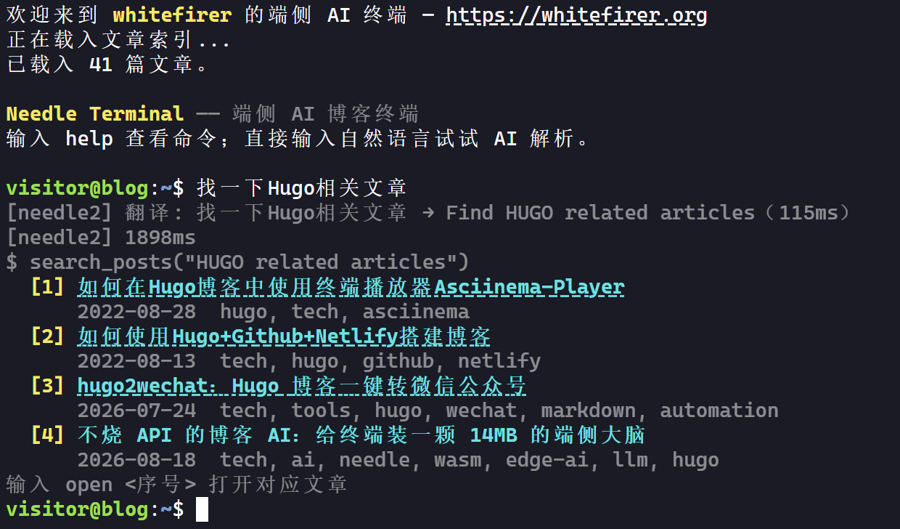
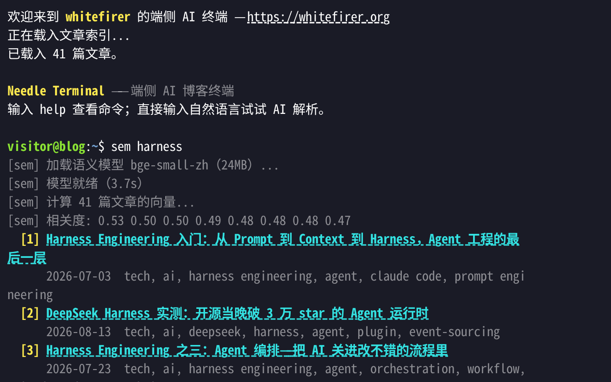

# 不烧 token 的博客 AI：给终端装一颗 14MB 的端侧大脑


## 一、动机：想要 AI，但不想烧 token

这个博客的首页有个终端，本来就是放着玩的。后来想给它加点"AI 助手"的味道——访客输入「找一下 deepseek 的文章」，终端自己检索、列出结果、附上链接。



最省事的接法是调云端 LLM API 做意图识别，但两个理由把我劝退了：一是每个访客每次提问都在烧我的额度，二是请求要出网，跟"纯静态博客"的气质不符。我想要的是**推理发生在访客自己的浏览器里**。

找到的答案就是 needle——GitHub 上的 [cactus-compute/needle](https://github.com/cactus-compute/needle)。

## 二、needle 是什么

needle 是 Cactus Compute 出的工具调用（tool-calling）专用小模型，现在的 needle2 有几个很硬的数字：

- **45M 参数**，量化后整个模型是一个 **14MB** 的 `.cact` 文件；
- 一个推理 session 约 **28MB RAM**；
- 输出被"字节级语法"约束：根据你声明的 tools JSON 编译出解码文法，**模型只能吐出合法的 JSON 调用，结构上不可能写坏**；
- 自带 confidence gating：答不了的请求返回空调用，失败模式是"拒答"而不是"乱执行"。

它不做闲聊、不写散文，唯一的工作就是：读你的 query，从声明的工具里挑一个，填好参数，吐回来。这恰好是"终端命令路由"需要的全部能力。



## 三、架构：三个文件的事

接入比想象中简单，核心就三样东西：

**1. 文章索引。** Hugo 构建时生成一个 `index.json`，里面是全部文章的标题、标签、摘要、链接。终端的搜索函数就是在这个 JSON 上做关键词匹配——needle 不负责搜，只负责**决定搜什么**。

**2. tools JSON。** 向 needle 声明博客能提供的能力：

```json
{
  "name": "search_posts",
  "description": "Search blog posts by keyword or topic",
  "parameters": {
    "type": "object",
    "properties": { "query": { "type": "string", "description": "search keywords" } },
    "required": ["query"]
  }
}
```

一共四个工具：`search_posts`、`list_recent_posts`、`list_posts_by_tag`、`describe_post`。官方文档反复强调"describe your tools well is the whole game"——工具描述写得好，路由就准，实测确实如此。

**3. 一个 Web Worker。** 推理放在 worker 里跑，主线程的终端 UI 不会被卡住，还能转等待动画、响应 Ctrl+C（直接销毁 worker 重建）。worker 内部就是三行核心调用：`needle_load` 载入权重 → `needle_init` 传入 system prompt 和 tools → `needle_complete` 一问一答。

**4. 懒加载。** 模型虽然有几个，但**没有一个会随页面加载**。终端启动只拉一个几十 KB 的文章索引；needle2 的 14MB 要等访客第一次输入自然语言才下载，sem 的 24MB 等第一次敲 `sem` 才下载，needle1 的 22MB 只有手动 `ai2 off` 切换后才碰。全都配了 `Cache-Control: immutable` 强缓存，第二次访问零流量。所以真实成本是：看文章的人一分流量不花，玩 AI 的人花 14MB。

## 四、踩坑实录

### needle1 的"中文友好"是个误会

我最先接的是 needle1（22MB 的 Rust/WASM 版）。它看起来能处理中文——「找一个 DeepSeek 的文章」真的能搜到——直到我翻开它的词表：8192 个词元，**一个 CJK 字符都没有**。它是纯字节级 BPE，所谓的中文能力其实是"把 query 的字节原样抄进参数"，抄回来的关键词恰好能命中搜索。代价是偶尔会抄坏：

```
$ search_posts("縠")
$ search_posts(" DeepSeek 繠")
```

这些乱码字符就是字节抄串了的证据。英文部分字节稳，所以还能救回来。这不是懂中文，是运气好。

### 一行 locale 救回 decode 失控

换到官方 needle2 后，中文输入直接现原形：要么拒答，要么 decode 失控一口气把 token 预算烧光（`tool call truncated: token budget exhausted`）。翻遍配置后发现它认 system prompt 里的 locale 声明，于是：

```js
// 官方模型只认英文输入（query 会先翻译成英文），locale 写死 en-US——
// 别的值配上英文 query 会让 decoder 说到 token 预算耗尽
const systemPrompt = `date: ${dateStr}; locale: en-US; device: browser`;
```

locale 定死 `en-US`，中文 query 则走 Chrome 的端侧 Translator API 先翻成英文再喂给它——不出网、不花钱，翻译痕迹还会打一行提示告诉访客发生了什么。

### 模型不够，规则来凑

45M 的模型总有边界，剩下的体验问题全靠一层薄薄的规则补丁兜住：

- **拒答改写**：模型返回空调用时，把冷冰冰的 `[]` 改写成"没听懂，试试更具体的说法，比如 xxx"；
- **指代消解**：「介绍第一篇」这种话，规则层直接映射到上一次搜索结果，不进模型；
- **复合指令**：「找一下 qemu 的文章并介绍第一篇」按连接词拆开，顺序执行；
- **搜索重试**：模型提取的关键词搜不到时，拿用户原始输入再搜一次——专治上面那种字节抄串。

### 语义兜底：sem 命令

关键词匹配天然有盲区（「降低大模型调用成本」搜不到讲 Prompt Caching 的文章），所以又加了一个 `sem` 命令：用 transformers.js 在端侧跑 bge-small-zh（24MB 的量化 ONNX）算向量相似度。这里踩了个值得记的坑：**hf-mirror 没有 CORS 头**，浏览器里 fetch 模型文件直接被拦——所以模型必须自己托管，运行时镜像兜底这条路不存在。



## 五、这颗模型能跑在什么硬件上

28MB RAM 这个数字决定了 needle2 的甜点区：**手机、树莓派、低配盒子**这类"弱但够"的设备，以及一切现代浏览器。按官方数据推断，这个量级在移动端 CPU 上跑到几百 tok/s 是合理的，工具调用一次输出不过几十个 token，体感就是秒回。

但再往下到 MCU 世界就不行了。比如我手边的 M5Stack StickS3（ESP32-S3，8MB PSRAM），离 28MB 差了近 4 倍，needle 不可能上片。这类设备的可行架构是 **hub + 执行端**：needle 跑在浏览器或主机里做路由，设备通过 WebSocket / BLE 接命令干活；如果只要「亮度调低」这种固定命令，乐鑫自家的 ESP-Skainet 甚至能在片上离线识别，连浏览器都不用开。

下一步就是把这个链路真做出来：让 StickS3 听懂「亮度调低」。跑通了再来写续篇。

## 六、收尾

整套东西上线后的成本结构我很满意：模型文件加起来 60MB 左右（needle2 14MB + needle1 备机 22MB + sem 24MB)，但全靠懒加载按需拉取，多数访客实际只下载 needle2 那一个文件；推理零 API 费用；数据和 query 从不出访客的浏览器。

如果你的场景也是"固定工具集 + 自然语言入口"，needle 这条路值得一试。官方还给了 LoRA 微调流程，用自己的工具 traces 练一遍，路由还能更准——这个坑留到以后填。

源码没单独开仓库——这套东西全是静态文件，就挂在这个博客上，直接扒就行：

- **主逻辑**：[/lib/blog-ai.js](/lib/blog-ai.js)——终端 UI、tools 声明、规则补丁，全在这一个文件里（不到 30KB）；
- **演示页**：[/html/terminal/](/html/terminal/) 是单文件页面，首页终端是它的嵌入版，查看源码即所得；
- **数据源**：[/index.json](/index.json)——不用自己做。这是 iLoveIt 主题给搜索功能生成的全站索引（标题、标签、摘要、正文分块），Hugo 构建时自动产出，终端直接复用它做关键词匹配；
- **模型文件**：needle2 的 `.cact` 权重和 WASM 运行时来自官方仓库 [cactus-compute/needle](https://github.com/cactus-compute/needle) 的发布，sem 的 bge-small-zh 量化 ONNX 自托管在 [/lib/sem/](/lib/sem/)（前文说过，hf-mirror 没 CORS，运行时镜像兜底这条路不存在）。

欢迎围观，玩坏了概不负责。

