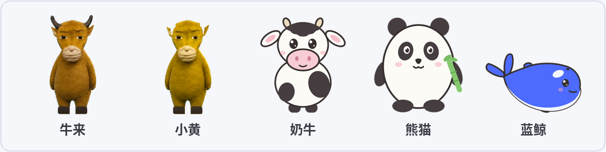
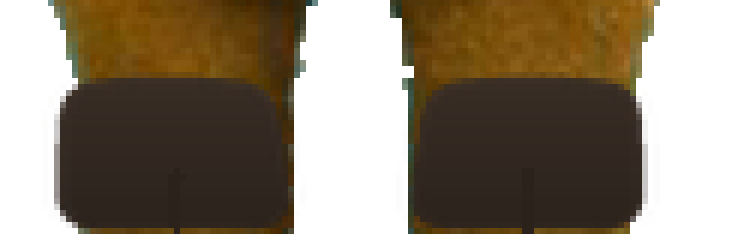
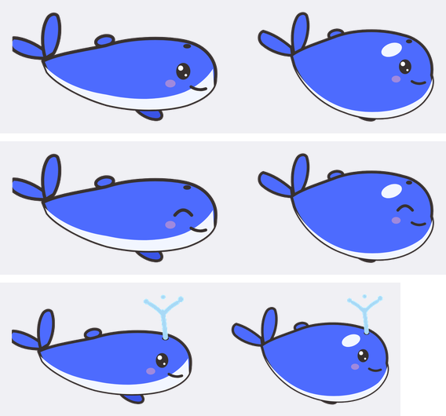

# 任务一完成，它就蹦出来喊「妈」——给 DeepSeek Harness 养一头牛来


## 一、先上成品

agent 干完活的那一刻，屏幕角落的小牛会蹦起来，字正腔圆地喊一嗓子「妈～～妈～～」——尾音拖足，嘴型跟上，中气十足：

<video controls preload="metadata" src="demo-pc.mp4" style="width:100%;border-radius:8px"></video>

PC 端：菜单、换皮肤、唠叨气泡、连喊三声的残影。手机端一样欢实——深色那条录到了蓝鲸喷水飞圈，浅色那条录到了奶牛和熊猫开嗓，两条的结尾都是「发消息 → agent 回完 → 蹦出来喊妈」的完整闭环：

<div style="display:flex;gap:8px">
<video controls preload="metadata" src="demo-phone-dark.mp4" style="width:50%;border-radius:8px"></video>
<video controls preload="metadata" src="demo-phone-light.mp4" style="width:50%;border-radius:8px"></video>
</div>

**不装 dsh 也能玩到它**：这插件是纯客户端的，同一套代码原样跑在裸页面上就是个小游戏——戳下面的试玩窗（或[打开全屏版](/niulai-pet/)），戳牛、跑个模拟任务，等它喊妈（公众号读者点「阅读原文」直达）：

<iframe src="/niulai-pet/" style="width:100%;height:560px;border:0;border-radius:8px;background:#0d1126"></iframe>

不认识这头牛的同学补一下背景：《牛来》是最近的一个现象级奇观——一部画风粗糙的 3D 动画片，上映前十天全国票房不到一万块，被短视频带火后一周直冲千万。全网看完都在骂，骂完接着看，号称"看了后悔 86 分钟，不看后悔一辈子"，[李永乐老师还专门讲过它爆火背后的禁果效应](https://mp.weixin.qq.com/s/_qiAyJZUjUQSUwAeSHELfQ)。主角那头丑得很有特色的黄牛，喊"妈"是名场面，二创鬼畜剪辑满天飞。我把它养进了 DeepSeek Harness（dsh）的 web 界面里——就是我最近连着折腾了好几篇的那个 agent 工作台。

## 二、为什么不是通知，是桌宠

dsh 跑任务时我经常切到别的桌面干活，完成通知这事我做过两轮：cenacle 通知中心、飞书卡片推送。都好使，但都太……正经了。

桌宠才是 AI 工作台缺的最后一块。它不提供信息，它提供**情绪价值**：平时在角落呼吸、眨眼、踱步、趴下打盹，偶尔冒个气泡吐槽一句「我在吃草，你在吃苦」；你跑 AI 久了它会报时「AI 已经跑了 2分13秒…」；任务完成的那一刻，它用最炸裂的方式替你庆祝。

选牛来当主角不需要理由，看到这头牛的人自然会懂。

## 三、它现在长什么样



- **五个皮肤**：牛来、小黄（幼年版，无角更黄亮）、奶牛、熊猫、蓝鲸——后三只没有现成素材，是我用 SVG 一只一只手绘的，蓝鲸特意调了 DeepSeek 蓝、加了虎鲸的白眼斑。（成文后又添了第六个「牛来原皮」：拿豆包生成的三视图抠的。牛来小时候没角——这是设定，不是抠图事故。）
- **签名动作**：牛来连跳、小黄和熊猫翻滚、奶牛摇摆、蓝鲸弧线跃出水面（到弧顶还会喷水）。动作可以绑到事件上，也能设成随机。
- **叫声**：牛来和小黄用原声（精修降噪过），奶牛/熊猫/蓝鲸的叫声是 WebAudio 现场合成的——哞、吱、鲸鸣，零素材零依赖。
- **唠叨气泡**：AI 在跑就报耗时，闲下来就随机吐槽，嫌烦可以在菜单里关掉。
- **右键菜单**：声音/完成时喊/气泡唠叨三个开关、连喊几声、动作绑定、换皮肤，还有个「关于」页，里面写着我的一句心里话：「我尽力了，只能做成这样了😂」。

## 四、纯客户端插件：dsh 插件的第三种形态

技术选型上一句话就够：这个插件**只有客户端**（`dsh.client`），没有任何 host 侧代码。

放到系列前两篇的坐标系里看，dsh 插件的三种形态就算凑齐了：

| 插件 | 形态 | 干什么 |
|---|---|---|
| dsh-browser-fs | 双面（host + client） | 注册模型工具，读写浏览器端文件 |
| dsh-cenacle-bridge | 纯 bundle（host） | 让既有开发系统与 dsh 桥接协作 |
| dsh-niulai-pet | 纯 client | 界面层行为，订阅只读服务 |

桌宠唯一需要的外部信号是"哪个会话在跑/跑完了"，dsh client runtime 本来就向插件发布 `sessions.list` 快照——订阅它即可，一行 host 代码都不用写。纯客户端的好处极其实在：**改完代码 `npm run build` 完刷新页面就生效，永远不用重启宿主**。

另一个红利开头已经看到了：把 sessions 订阅换成一个模拟任务驱动，`pet.ts` 一行没改就跑在裸页面上——本文的在线试玩页就是这么来的，不是什么另写的复刻版。

任务完成的判定就两条：`running` 从 true 翻成 false（当前会话跑完），或 `completed` 新置位（后台会话完成，即侧边栏绿点的同一信号）。宿主太旧没有 sessions 服务时降级成纯手动戳。

## 五、制作过程：每一环都在打仗

### 形象：抠图只是开始，修图才是战役

别问我为什么还有这步骤，问就是全自动的。

- **犄角没了**：牛角是深炭色，颜色阈值抠图直接把它当背景丢了——一只全没，一只只剩半截。放宽暗色区间重抠才找回来。
- **蹄子被草吃了**：原帧里牛蹄埋在草里，抠出来就是两条断腿。抠图解决不了，只能造：按腿的宽度重建小腿、补上深色蹄冠。第一版是两块矩形，丑得像贴的砖；返工版改成了微梯形 + 正中分趾缝（偶蹄目的灵魂）+ 纵向渐变 + 微外八站姿。



### 喊声：选段、鉴假、降噪

喊声备了四段候选，其中两段怎么听都不像牛来的声音——不是耳朵好，是我跑了自相关基频分析：正常奶声基频 800-889Hz，那两段只有 516-552Hz。**它们是被加速过的变调段，音调跟着速度一起飞了**，低近一半的基频就是铁证。

留下来的两段背景音又大（BGM 焊死在音轨里），上 ffmpeg 降噪：`highpass` 专治轰隆隆的低频（人声基频 800Hz，高通切到 280Hz 都伤不到它）、`afftdn` FFT 降噪压 BGM。我做了七档对比反复听，选定中强档——再狠人声就出"水下音"了。

### 嘴型：尾音要一直张着嘴

第一版的嘴是在喊声全程不停开闭的，看着像打机关枪。不对——「妈-妈～～」是两个音节，**尾音是开口音**：正确的时间线是张嘴 240ms → 闭 120ms（两个音节的分合）→ 重新张开，**一直保持到尾音结束**才闭上。

时长也不能写死：插件在挂载时预读 mp3 的 metadata 拿真实时长，嘴型、气泡都跟着音频长度走，连喊几声时是串行接龙，每声之间自然闭一下。

### 动画：单图变形 + 少量换帧，还有三个坑

桌宠没有序列帧素材，90% 的动作是单张 PNG 的 WAAPI 变换：呼吸是 scaleY 正弦，蹦跳带 squash&stretch，飞行是根元素走抛物线 + 机身沿切线俯仰。只有嘴型、眨眼、飞行姿态、鲸鱼喷水这几处用双帧切换。

踩了三个值得写下来的坑：

1. **pause 的动画不是透明的**。呼吸动画 pause 后仍压在 `img` 的 transform 上（WAAPI 在级联里压内联样式），飞行时机身旋转死活不生效——改 `cancel()` 才行。
2. **镜像父级里的 rotate 不能乘方向**。朝向翻转用根节点 `scaleX(-1)`，镜像会把精灵图和旋转一起翻，两个方向自洽；我多乘了一个方向系数，牛直接底朝天飞。
3. **协程收尾别抢状态**。踱步协程结束时无条件 `mood = 'idle'`，把刚起飞的飞行状态绞杀在半空——所有收尾都加了身份检查。

### 叫声：零素材方案

三只手绘动物没有真声可截，干脆全部 WebAudio 合成：哞 = 锯齿波下滑 + 低频震颤 + 低通；鲸鸣 = 正弦长音先扬后抑 + 慢颤音；吱声 = 两声三角波短促上挑。总共不到 60 行代码，一个音频文件都不用下载。

### 手绘三小只



奶牛、熊猫、鲸鱼都是手写 SVG 渲染成 PNG，迭代了好几轮：鲸鱼的尾鳍一度像兔子耳朵，熊猫的竹子一度像拿着话筒。家族一致性靠三件套：同款描边色、大眼双高光、粉腮红。

### 录视频：手机录屏它不出声

开头三条视频的录制本身也是一场仗。PC 版一次成型（宿主机录屏能带上系统声音），但两条手机版遇到了新问题：**手机录屏录不到系统内放**——屏幕录像走的是麦克风，桌宠喊得再字正腔圆，录出来也只剩 -46dB 的环境底噪。

解法是时间戳配音法的升级版：先按 0.25 秒一帧抽接触表，把每个气泡（「妈～～妈～～」「哞——！」「嗯嗯！」「噗——！」）出现的精确时刻抠出来；声源不走录音——「妈～～妈～～」直接用仓库里的无损 mp3，奶牛/熊猫/蓝鲸的叫声则把插件里的 WebAudio 合成代码原样搬进 OfflineAudioContext 离线渲染成 WAV（和运行时发出的声音逐字节一致、零底噪）；最后按时间戳 `adelay` 混回去，顺手把 HEVC 转成全浏览器通吃的 h264。音画对齐误差百毫秒级，音质比现场采的干净一个数量级。

## 六、一些小但重要的设计

- 「喊一声」只喊不跳，「戳一下」又喊又跳——一个是嘴上功夫，一个是全身反应。
- 静音是真静音：没有声音也没有「妈～～妈～～」气泡，庆祝退化成纯动作。
- 完成时喊妈可以关，连喊几声可以设（1-3 声），动作可以绑成固定或随机。
- 位置、皮肤、所有开关都记忆在 localStorage。

## 七、安装与素材

一行装上：

```sh
dsh plugin --profile web add dsh-niulai-pet                     # npm（推荐，国内网络更稳）
dsh plugin --profile web add github:whitefirer/dsh-niulai-pet   # 或从 GitHub
```

构建产物已入库，安装零脚本；首次安装重启一次 dsh web，之后升级刷新页面即生效。奶牛/熊猫/蓝鲸三只手绘的 SVG 源文件在仓库 `tools/drawn/` 里，随便拿去用。

## 八、收尾


至此我的 dsh 插件小系列凑齐了三种定位：通用能力、开发能力、娱乐休闲。说实话，最后一个是我打开 dsh 时嘴角上扬幅度最大的一个。

下一步：自定义皮肤（导入自己的图和声音）、按住它说话的语音控制（识别完直接发给当前会话，STT 选型调研已经躺在仓库 `docs/roadmap.md` 里）、插件市场收录（awesome 门槛是仓库满一天 + 提交数 ≥10，CI 自动校验，PR 已在路上）。仓库在 [github.com/whitefirer/dsh-niulai-pet](https://github.com/whitefirer/dsh-niulai-pet)，素材全入库，装上即玩。

