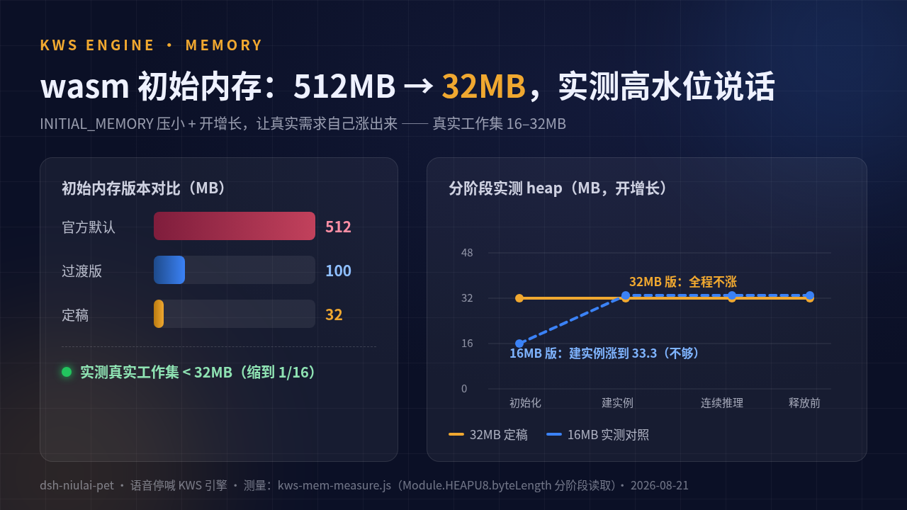

# 给 DeepSeek Harness 桌宠装耳朵：浏览器里跑中文 KWS 的全记录


## 一、需求

牛来桌宠（dsh 的桌宠插件，它的诞生记见本系列上一篇）有个「循环喊到互动停止」模式：任务一完成，它就喊妈，一直喊，喊到你理它为止。戳一下能停，打字也能停，这次应 [B 站评论区](https://www.bilibili.com/video/BV1iN8p6AEV5) 的要求加了玩法：喊一声「牛来」就停。电影《牛来》里妈妈就是这么喊它的，台词闭环。

要实现这个，桌宠得有耳朵：浏览器里、本地跑、中文、只认一两个指令词、不能把它自己喊的「妈妈」当成指令。这是典型的 KWS（关键词识别）场景——Amazon 管这个叫唤醒词（wake word），就是「Hey Siri」要先过的那一环。

有人问为什么不直接调云上的语音识别 API。隐私上，麦克风音频不该出浏览器；成本上，循环喊期间要一直开听，按分钟计费肉疼；延迟上，本地推理 0.9 秒音频只要 25 到 40 毫秒，云上走一圈够它喊三声妈了。整句 ASR 也不合适，模型几百 MB 起步，一个桌宠背不动。

这双耳朵的四代演进，全部在一天内完成，数据都实测过。

## 二、v1：零模型模板匹配，能用，但有天花板

第一版不依赖任何模型：MFCC 39 维特征 + 子序列 DTW 匹配。思路是把电影里妈妈喊「牛来」的原声当模板，麦克风输入实时算特征，滑窗对齐，距离小于阈值就命中。

为了让它在真实麦克风环境能用，还加了两样：谱减降噪（逐 mel bin 跟踪底噪 EMA）、双端 CMN（倒谱均值归一）。判定做了防抖，连续 3 帧过阈才算命中，阈值可在设置里调。

判别力：正样本最高 0.43，负样本最低 0.66，阈值 0.54 夹在中间，正负样本完全分开。自己喊「牛来」很灵。

天花板也明显：**模板是电影配音演员的嗓音，你的嗓音对不上就是对不上**。这个缺陷没有工程解，只能靠自录模板兜底（设置里可以录 1.9 秒你自己的「牛来」，本人嗓音几乎必中）。另外零模型方案分不清近音词，「你又来」和「牛来」在它眼里差不多。

它现在还在代码里，当轻量路径和降级方案：KWS 装载失败就自动回落到它。

## 三、v2：sherpa-onnx KWS，wasm 得自己编

这次用上了语音识别模型。选型 sherpa-onnx 的 KWS 流式识别，模型是 zipformer wenetspeech 3.3M 参数的 int8 版，中文，专为关键词场景训练，社区验证充分。

官方没有发布开箱即用的 KWS wasm 产物，得自己编。源码走 codeload tarball（本机 git clone GitHub 间歇被重置，tarball 直连稳定），emsdk 4.0.23 装上，模型三件套（encoder/decoder/joiner int8 + tokens.txt）塞进 assets，再做三处源码小改，emscripten --preload-file 一把出。产物四个文件：12MB wasm 运行时（gzip 后 3.4MB）、4.8MB 模型数据、loader 和 JS glue。构建纪要留在仓库文档里，可复现。

另一个麻烦是这 17MB 从哪加载。走 CDN 最省事，但插件给别人用，哪天 CDN 挂了或者用户内网隔离，耳朵就聋了。dsh 插件架构里，客户端半（浏览器里那个 bundle）没有静态资源路径，所以让插件的 host 半（跑在 dsh 服务端那部分）开了一条 `/niulai-kws` 路由，把四个文件**同源分发**出去。同源还顺手解决了 wasm 编译缓存和 HTTP 缓存。

关键词配置也直接内联进字符串，不依赖额外文件：

```
n iú l ái @牛来
n ǐ y òu l ái @牛来A
n ǐ y ǒu l ái @牛来B
n iú y òu l ái @牛来C
```

主词一行，实际发音变体三行（真的会有人喊成「你又来」「你过来」）。threshold 0.1、score 1.5，node 侧语料标定出来的。

## 四、v3：内存，从 512MB 砍到 32MB

官方 demo 的 emscripten 默认 `INITIAL_MEMORY=512MB`。一个桌宠，平时在角落呼吸打盹，一开听就先圈 512MB 线性内存，说不过去。

wasm 线性内存有个特性：**只涨不缩**。`kws.free()` 只是把 C++ 对象还给 wasm 堆，物理内存不会还给浏览器。所以 512MB 一旦圈了就是永远。

定稿方法很直接：把 `INITIAL_MEMORY` 压小，开 `ALLOW_MEMORY_GROWTH`，让真实需求自己涨出来，逐阶段读堆大小：

| 初始内存 | 运行时初始化 | createKws（4 词 10 变体） | 连续推理 | 结论 |
|---|---|---|---|---|
| 512MB（官方默认） | 512 | 512 | 512 | 圈地闲置约 16 倍 |
| 16MB | 16.0 | 涨到 33.3 | 33.3 | 不够 |
| **32MB（定稿）** | 32.0 | 32.0（不涨） | 32.0（不涨） | 真实工作集 <32MB |



真实工作集在 16 到 32MB 之间，32MB 全程零增长（16MB 档那个 33.3 是增长步进的超调，不是真实需求超了 32MB）。初始即高水位最稳，增长有拷贝停顿，`ALLOW_MEMORY_GROWTH` 留作安全网。内存参数只影响装不装得下，不影响模型数学，27 条语料在 512MB 版和 32MB 版上逐样本结果一致。

## 五、v4：Web Worker 化，空闲 10 秒真释放

内存压到 32MB 还是常驻。桌宠 99% 的时间不需要耳朵，只在「循环喊」布防期间才听。

解法是把 KWS 整个塞进 Web Worker：模型驻留在 worker 堆里，主线程 postMessage 喂音频流（buffer transfer 零拷贝），命中回调。引用计数归零后再空闲 10 秒，直接 `worker.terminate()`。

为什么要 terminate 这么粗暴：上一节说了，wasm 内存只涨不缩，`free()` 不还真，**terminate 是唯一可证明的释放路径**，整个 wasm 实例被 GC，内存真归还。

重建成本实测 1.4 到 1.9 秒（wasm 编译缓存 + HTTP 缓存命中，含 4.8MB 模型装载和建实例），下次开听无感。加载时机也卡死了：插件运行不加载、开开关不加载，真正开听才加载。不听的时候，零 wasm 开销。

stream id 多路复用，设置卡片里的「测一测」和正式监听可以共存于同一个 worker。

## 六、判别力


全量 27 条 16kHz 语料：20 通过，失败的 7 条全部是极端对抗样本（升调、加速加噪、-25dB 白噪、远场录音），失败集和 node 原生 int8 完全一致，也就是说 wasm 版和原生版数学上没差别，该认错的都是模型固有边界。

负样本这一行：**妈妈喊声×4、静音、白噪、他人语音×2、歌声，9 条，零误报**。宠物自己正在那喊「妈～～妈～～」，绝不能喊着自己把自己停了，这是功能杀手，过了这条线别的都好说。

指令词也从 1 个扩到 4 个可配：牛来（默认）、别喊了、安静、停下，每个带音素变体。四词交叉验证（59 条 TTS 语料 + 9 条负样本）：**串词为零**（喊 A 词命中 B 词的次数），负样本零误报。漏检集中在陕西口音级重口音和 +20% 超速语音，试过加变体硬修，无效还涨误报风险，不堆变体，用户换个自己喊着顺的词就行。

已知近音代价：「你又来」会命中牛来变体。音素变体的固有代价，记在这。

## 七、真机最后一坑：音量小识别不到

真机反馈，安静环境小声喊，识别不到。排查下来，干净语音压到 -24dB 模型不要增益也照中，问题出在别处：**低电平 + 浏览器噪声抑制把弱语音当噪音吞了**。

对策两层：`getUserMedia` 开 `autoGainControl`，从源头放大（先于噪声抑制管线）；再加一个软件增益滑杆（1.0 到 4.0 倍，tanh 软削波防爆音），正式监听热生效，测试界面和录音同一条管线。

增益安全性：负样本开 4 倍零误报，正常音量开 3 倍仍命中。增益救不了频谱退化型对抗样本，那是音量无关的已知限制，不挣扎。

## 八、现在的样子

设置卡片里可以选引擎（模板/KWS）、勾指令词（四词多选）、调增益、开「测一测」界面实时看命中。循环喊布防时麦克风自动开听，喊一声「牛来」，它闭嘴，妈妈录音回一句「牛来！」收尾，台词闭环达成。想听实际效果的，B 站有这期的实测视频：[喊一声「牛来」它就闭嘴——牛来桌宠能听懂人话了](https://www.bilibili.com/video/BV19f8B63EGG)。

整个链路零云端：模型本地跑，音频不出浏览器。

项目开源，已被 awesome-dsh-plugin 收录，插件市场搜 dsh-niulai-pet 就能装。wasm 构建纪要、内存实测脚本、27 条语料复跑清单都在仓库文档里。

## 附：已知限制清单

1. 重口音（陕西话级）和 +20% 超速语音会漏检，四词同患。
2. 「你又来」近音会触发牛来，变体代价。
3. 极端对抗扰动（升调/加速加噪/白噪糊脸）漏检，与 node 一致，模型固有。
4. 真机麦克风召回受设备和距离影响，模板引擎另有自录模板兜底。
5. 老 dsh 无 webServer、worker 被拦等场景，自动回落模板引擎。

