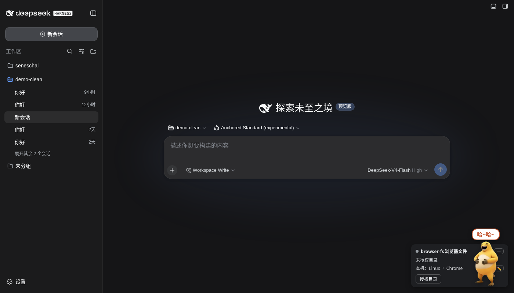
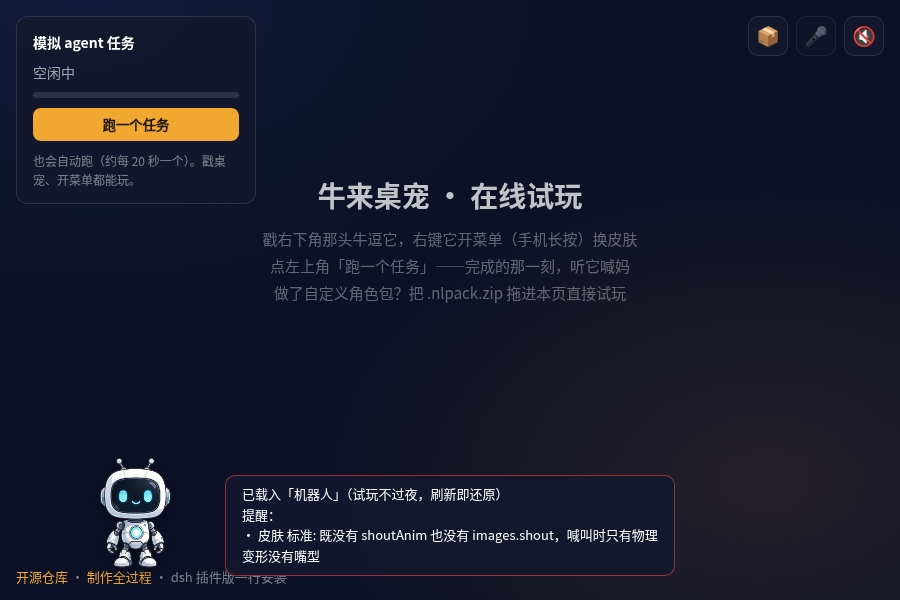
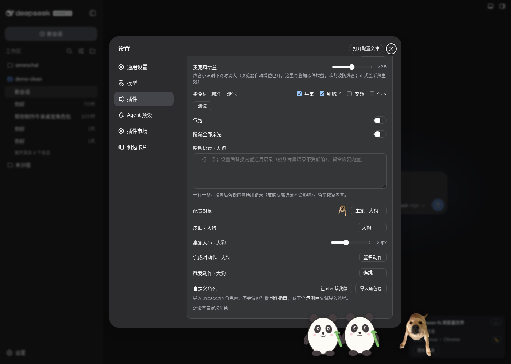
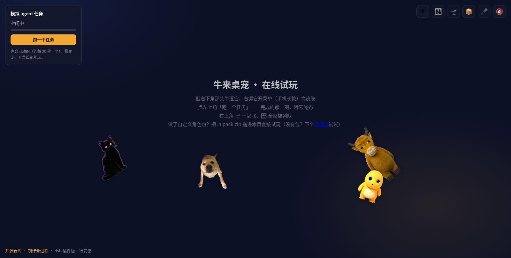
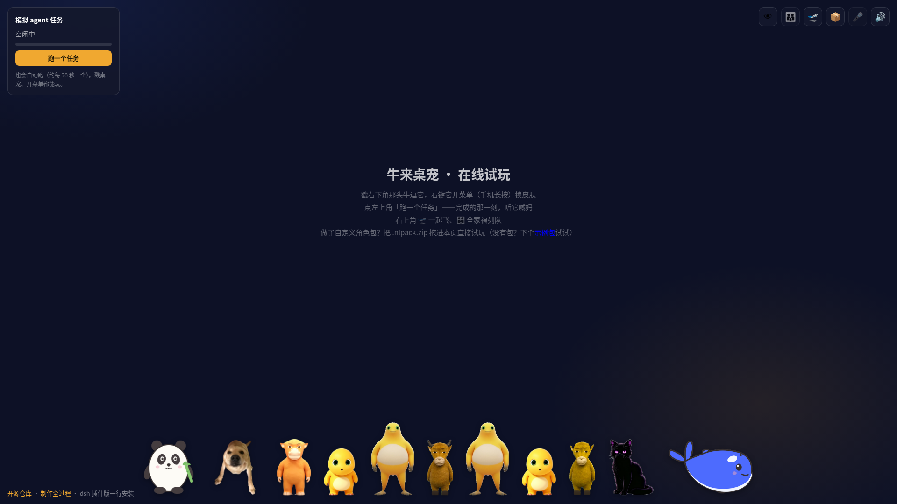
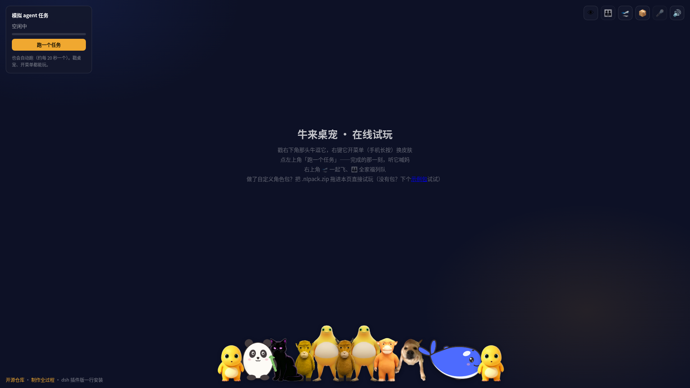

# 史诗级更新：自定义角色和桌宠乐园——DeepSeek Harness 桌宠插件 v0.4 全记录


## 一、这期有点多，先报个幕

上一期给桌宠装了耳朵（喊一声「牛来」它就停，[浏览器里跑中文 KWS 的全记录](/posts/2026/08/22/dsh-niulai-pet-kws/)）。这期本来只想把预告过的自定义皮肤做掉，结果收不住：[B 站评论区](https://www.bilibili.com/video/BV1iN8p6AEV5)点名的奶龙大笑和大狗叫得安排；角色一多，一只变多只；多只就会互相穿模，于是有了物理碰撞；都能站一排了，干脆再来张全家福。

从 v0.3.0 到 v0.4.7，二十六个 commit，桌宠从一只变成一群。一个个说。

## 二、新成员：评论区点名的都加了

**奶龙（捧腹大笑）**。第一期视频评论区点名要奶龙。叫声是原片大笑段完整降噪，15.7 秒；画面从视频切片抠帧，157 帧 webp 按 10fps 原生播放，和音轨同一条时间线——任务一完成，它从站姿弯腰捧腹，笑到抱头倒地打滚，结尾不吞。这条素材踩了两个坑：帧清洗曾把胸前白斑当水印抹掉（后改中位数底图差分，再把内部小洞做原色回填，胸斑眼白全恢复）；大笑帧的头顶曾被裁切框切掉一截，裁切对齐按全序列最高帧重做，只裁该裁的 7px。另外倒地帧同机位物理缩放，不然倒地打滚会比站着大一圈。



**大狗**。第二期视频评论区要的「大狗叫」。立绘来自开源项目 [Dagou-Tap-New](https://github.com/MarkCup-Official/Dagou-Tap-New)（自带 alpha，不用抠图），叫声是「大狗大狗叫叫叫」链式合成，签名动作连跳。

**赛博猫**。两张猫图（一站一趴）抠出来上岗，配的是真猫叫。平时趴着睡，喊叫才站起来，声止再站两秒半才趴回去。趴睡图顺带开了一个新通道 `images.sleep`，还为趴睡类皮肤修了嘴型「合嘴」相位闪回睡图的问题。

**小奶龙（奶龙宝宝）**。和奶龙不撞脸，AI 生图动作条切帧 +「我才是奶龙」原声切片，喊叫带逐帧演出。默认个子 100px，奶龙 155px，爷俩站一起不用调。

**奶牛退役**。初代手绘奶牛实现简单、质量差点意思，这期退役给新成员腾位置，SVG 存档留在仓库 `tools/drawn/`。

## 三、自定义角色包：上期挖的坑填了

上期预告过的自定义皮肤，落地成了「角色包」：一个 `.nlpack.zip`（`pack.json` + 透明底图 + mp3 叫声）就是一个完整角色。两级模型（角色/皮肤），导入带 zip 校验，IndexedDB 持久化，删除自动回落内置皮。

使用路径：设置卡片「自定义角色」区导入；试玩页把 `.nlpack.zip` 直接拖进页面即时预览（不落库，刷新即还原）；不会做包的，卡片上有个「让 dsh 帮我做」按钮——让 agent 自己给你搓一个。仓库里放了个最小[示例包](https://github.com/whitefirer/dsh-niulai-pet/raw/master/docs/assets/robot.nlpack.zip)（一个无名机器人）专门用来试导入流程，从零做包看 [SKIN_AUTHORING.md](https://github.com/whitefirer/dsh-niulai-pet/blob/master/SKIN_AUTHORING.md)，AI 生图提示词、逐帧动作条切分、派生覆盖包玩法都在里面。



这区还修了个 bug：删除或导入角色包后，所有桌宠有几率变成同一只，整体刷新才恢复。根因是订阅皮肤列表的回调里误用了全局 `skin` 而不是各只自己的 `mySkinId`——列表一变，全员跟着换脸。已修。

## 四、从一只到多只：按只配置是正常需求

主宠右键「再添一只」，上限默认连主 10 只，设置里最高能调到 15。皮肤、大小、唠叨语录全部按只存。

设置卡片为此大改：多只时顶部出现「配置对象」选择器，带皮肤预览图，**点预览图，对应那只桌宠会发光加小跳回应**——一屏十几只的时候，不用猜自己在配哪只。大小从数字输入改成滑杆（72-200px，按皮肤带默认值），偏离默认时出现「重置」按钮。语录一行一条，按只编辑。



## 五、物理碰撞：一维世界加一道高度门槛

多只同屏第一天就发现问题：桌宠互相穿模，挤在一起不分彼此。于是做了一套简化物理：x 轴一维世界，走近互挤，撞狠了弹飞，落地和重撞有闷响。开关制，右键菜单「物理碰撞」开。

还补了两处：

- **误推的坑**：初版只按 x 轴判断，没管被拎状态——你拎着一只越过另一只头顶，底下那只照样被推开，因为被拎着时和对方不在一个平面。挤压判定加了高度门槛：被拎者脚底高过对方头顶就不触发。
- **砸到头上，按落差定反弹强度**。拎到半空松手砸中，和齐头高蹭到，不是一个量级，反弹速度随落差走。
- 坠落过程身体是倾斜的，只有落地后才恢复直立。

试过做真堆叠（站上别只头顶），效果怪，砍了，这个限制记在最后。

## 六、乐园玩法：一起飞和全家福

试玩页右上角两个整活按钮，插件侧在主宠菜单里：

**一起飞**：彩带式持续起飞。一只接一只从随机一侧飞出，航道、时长、间隔全部带随机；只显示飞行中的桌宠，站立的先藏起来；同时在飞的有并发上限（阵容的一半），多了排队，不会糊成一团。落地藏宠和 flight 收尾在同一个同步段完成（`onFlightEnd` 回调），零闪烁。飞行期间不触发任务庆祝——不然庆祝会把飞着的拽回地面。



**全家福**：两档排布循环切换。均匀列队——牛来 C 位，奶龙、小奶龙一边一个对称站；层次合影（桌宠总动员）——高个靠后、矮个往前，相邻叠压约四分之一身位，叠出前后纵深。合影期间主宠钉住置顶不被挡，收起后各回各位。排布逻辑抽成了共享模块（`src/client/family.ts`），试玩页和插件两侧跑同一套代码。





## 七、其它功能细节

- **默认不打盹了**。闲置打盹改开关制、默认关——太多人不知道它会趴下，以为它死了。
- **气泡开关语义修正**。之前关了气泡，连任务完成的通知气泡也没了。现在装饰性唠叨全收进开关，反馈性气泡（任务完成、操作提示）保留。
- **隐藏全部开关**。一键全收，菜单和设置卡片都有；试玩页右上角有 👁 能把它们喊回来。
- **「喊一声」改名「表演一下」**。语音停喊上线后，菜单里两个「喊」歧义了。
- 试玩页埋了个 hits.sh 隐身统计，看看有多少人真来玩。

## 八、现在的样子

[在线试玩](https://whitefirer.org/niulai-pet/)同一套代码，免安装：点「跑一个任务」听它喊妈，右上角一起飞、全家福列队、拖入角色包都能玩。装到 dsh 里：

```sh
dsh plugin --profile web add dsh-niulai-pet
```

项目开源，插件市场搜 `dsh-niulai-pet` 即是。想看实际效果的，B 站有这期的视频：[史诗级更新：自定义角色和桌宠乐园——牛来桌宠 v0.4](https://www.bilibili.com/video/BV1pC8b6hEhQ)，整个系列的[视频合集](https://space.bilibili.com/10317688/lists)也在连载，播放量和转发量尚可。

## 附：已知限制清单

1. 只做了地面排挤，没有做 y 轴堆叠效果。
2. 奶龙大笑 15.7 秒是原片大笑段的完整长度，再长只能循环帧，暂时不续。
3. 自定义包可选通道缺了可兜底，但有代价：没有 `images.shout` 的角色，喊叫时只会有物理变形没有嘴型（导入时会有提示）。
4. 位置记忆按设备存 localStorage，如果换浏览器，桌宠会重置归位。

